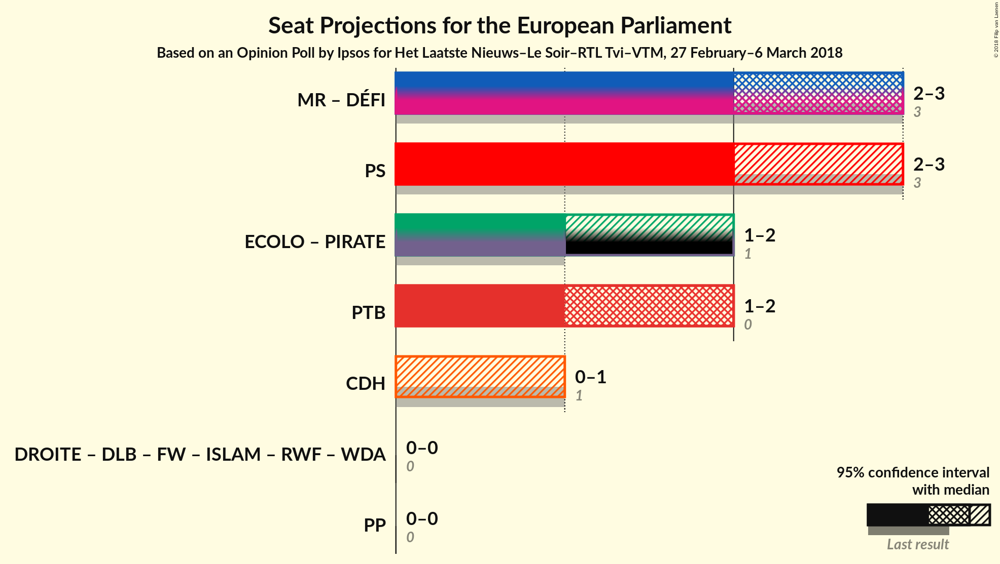

# Opinion Poll by Ipsos for Het Laatste Nieuws–Le Soir–RTL Tvi–VTM, 27 February–6 March 2018

Areas included: Brussels, Wallonia

<a href="#voting-intentions">Voting Intentions</a> | <a href="#seats">Seats</a> | <a href="#coalitions">Coalitions</a> | <a href="#technical-information">Technical Information</a>

## Voting Intentions

### Confidence Intervals

| Party | Last Result | Poll Result | 80% Confidence Interval | 90% Confidence Interval | 95% Confidence Interval | 99% Confidence Interval |
|:-----:|:-----------:|:-----------:|:-----------------------:|:-----------------------:|:-----------------------:|:-----------------------:|
| PS | N/A | 22.9% | 21.4–24.6% |21.0–25.1% |20.6–25.4% |19.9–26.2% |
| MR | N/A | 20.9% | 19.5–22.5% |19.1–23.0% |18.7–23.4% |18.0–24.1% |
| PTB | N/A | 15.7% | 14.4–17.2% |14.1–17.6% |13.8–17.9% |13.2–18.7% |
| Ecolo | N/A | 14.6% | 13.3–16.0% |13.0–16.4% |12.7–16.7% |12.1–17.4% |
| DéFI | N/A | 8.0% | 7.1–9.1% |6.8–9.5% |6.6–9.7% |6.2–10.3% |
| cdH | N/A | 7.1% | 6.2–8.2% |6.0–8.5% |5.8–8.7% |5.4–9.3% |
| Parti Populaire | N/A | 3.9% | 3.2–4.7% |3.0–4.9% |2.9–5.1% |2.6–5.5% |
| La Droite | N/A | 0.9% | 0.6–1.4% |0.5–1.6% |0.5–1.6% |0.4–1.9% |

*Note:* The poll result column reflects the actual value used in the calculations. Published results may vary slightly, and in addition be rounded to fewer digits.

## Seats

### Confidence Intervals

| Party | Last Result | Median | 80% Confidence Interval | 90% Confidence Interval | 95% Confidence Interval | 99% Confidence Interval |
|:-----:|:-----------:|:------:|:-----------------------:|:-----------------------:|:-----------------------:|:-----------------------:|
| <a href="#ps">PS</a> | N/A | N/A | N/A |N/A |N/A |N/A |
| <a href="#mr">MR</a> | N/A | N/A | N/A |N/A |N/A |N/A |
| <a href="#ptb">PTB</a> | N/A | N/A | N/A |N/A |N/A |N/A |
| <a href="#ecolo">Ecolo</a> | N/A | N/A | N/A |N/A |N/A |N/A |
| <a href="#défi">DéFI</a> | N/A | N/A | N/A |N/A |N/A |N/A |
| <a href="#cdh">cdH</a> | N/A | N/A | N/A |N/A |N/A |N/A |
| <a href="#parti-populaire">Parti Populaire</a> | N/A | N/A | N/A |N/A |N/A |N/A |
| <a href="#la-droite">La Droite</a> | N/A | N/A | N/A |N/A |N/A |N/A |

## Coalitions

## Technical Information

### Opinion Poll

+ **Polling firm:** Ipsos
+ **Commissioner(s):** Het Laatste Nieuws–Le Soir–RTL Tvi–VTM
+ **Fieldwork period:** 27 February–6 March 2018

### Calculations

+ **Sample size:** 1194
+ **Simulations done:** 0
+ **Error estimate:** 100.00%

