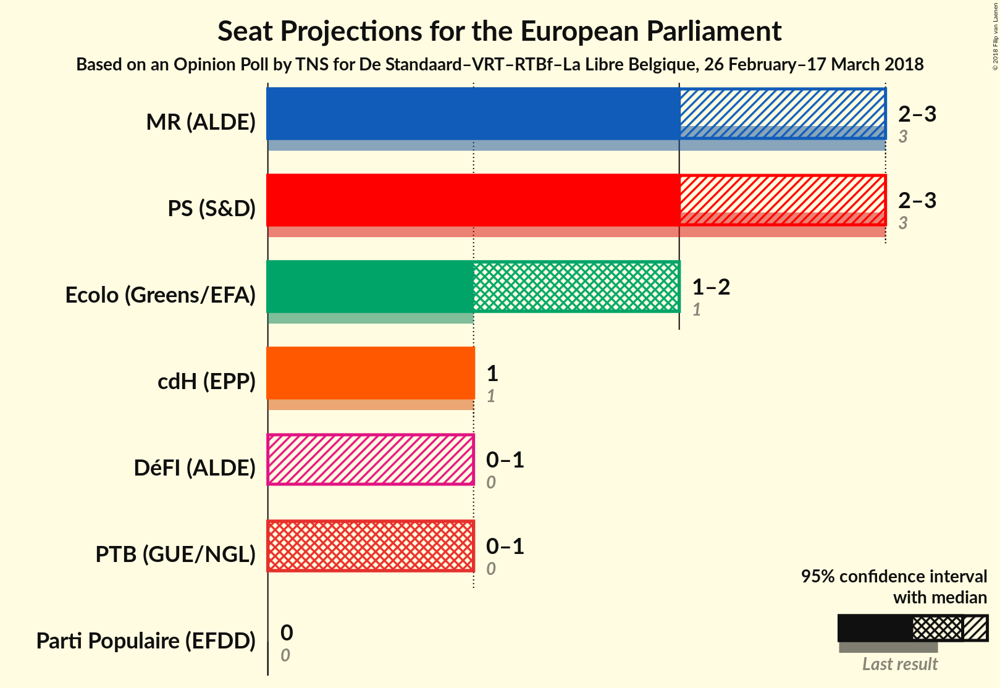
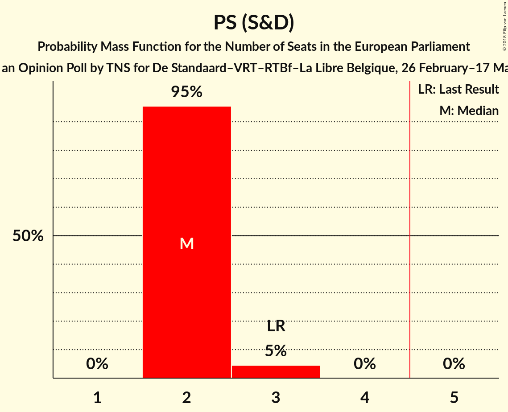
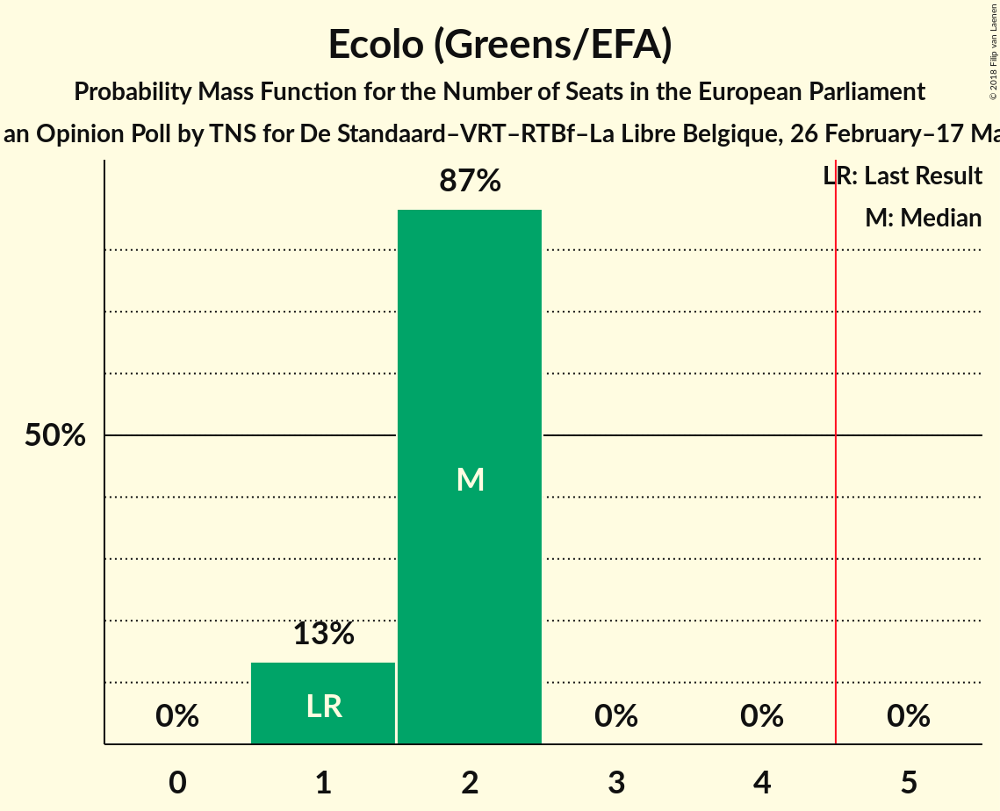
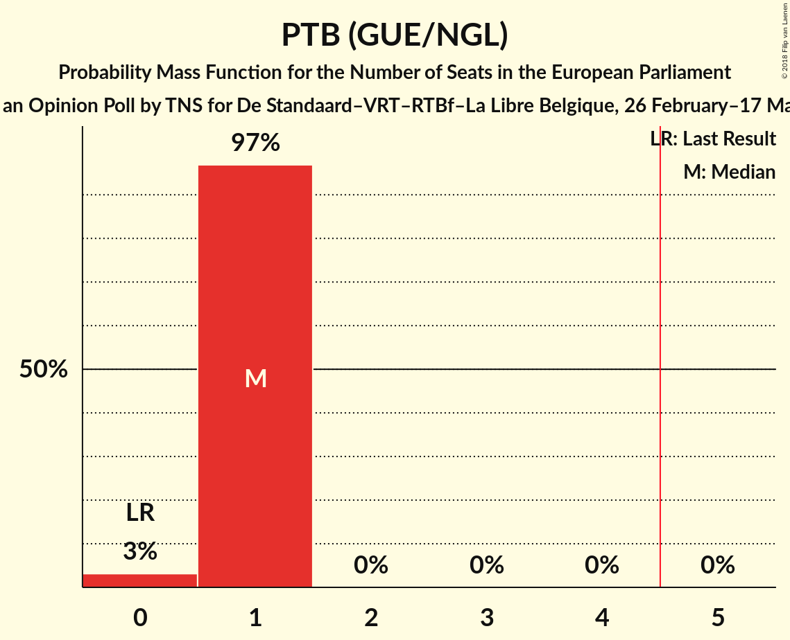
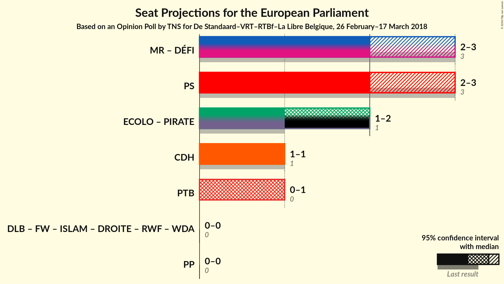

# Opinion Poll by TNS for De Standaard–VRT–RTBf–La Libre Belgique, 26 February–17 March 2018

Areas included: Brussels, Wallonia

<a href="#voting-intentions">Voting Intentions</a> | <a href="#seats">Seats</a> | <a href="#coalitions">Coalitions</a> | <a href="#technical-information">Technical Information</a>

## Voting Intentions

### Confidence Intervals

| Party | Last Result | Poll Result | 80% Confidence Interval | 90% Confidence Interval | 95% Confidence Interval | 99% Confidence Interval |
|:-----:|:-----------:|:-----------:|:-----------------------:|:-----------------------:|:-----------------------:|:-----------------------:|
| MR (ALDE) | 27.1% | 23.8% | 22.3–25.4% |21.9–25.9% |21.5–26.3% |20.8–27.1% |
| PS (S&D) | 29.3% | 23.3% | 21.8–24.9% |21.4–25.4% |21.1–25.8% |20.4–26.6% |
| Ecolo (Greens/EFA) | 11.7% | 18.0% | 16.6–19.5% |16.3–19.9% |15.9–20.2% |15.3–21.0% |
| cdH (EPP) | 11.4% | 10.9% | 9.9–12.2% |9.6–12.5% |9.3–12.8% |8.8–13.4% |
| PTB (GUE/NGL) | 5.5% | 9.9% | 8.9–11.1% |8.6–11.4% |8.3–11.7% |7.9–12.3% |
| DéFI (ALDE) | 3.4% | 7.2% | 6.3–8.2% |6.1–8.5% |5.9–8.8% |5.5–9.3% |
| Parti Populaire (EFDD) | 6.0% | 3.2% | 2.6–3.9% |2.5–4.1% |2.3–4.3% |2.1–4.7% |

*Note:* The poll result column reflects the actual value used in the calculations. Published results may vary slightly, and in addition be rounded to fewer digits.

## Seats

### Confidence Intervals

| Party | Last Result | Median | 80% Confidence Interval | 90% Confidence Interval | 95% Confidence Interval | 99% Confidence Interval |
|:-----:|:-----------:|:------:|:-----------------------:|:-----------------------:|:-----------------------:|:-----------------------:|
| <a href="#mr-(alde)">MR (ALDE)</a> | 3 | 2 | 2 |2 |2 |2 |
| <a href="#ps-(s&d)">PS (S&D)</a> | 3 | 2 | 2 |2 |2 |2 |
| <a href="#ecolo-(greens/efa)">Ecolo (Greens/EFA)</a> | 1 | 2 | 2 |2 |2 |2 |
| <a href="#cdh-(epp)">cdH (EPP)</a> | 1 | 1 | 1 |1 |1 |1 |
| <a href="#ptb-(gue/ngl)">PTB (GUE/NGL)</a> | 0 | 1 | 1 |1 |1 |1 |
| <a href="#défi-(alde)">DéFI (ALDE)</a> | 0 | 0 | 0 |0 |0 |0 |
| <a href="#parti-populaire-(efdd)">Parti Populaire (EFDD)</a> | 0 | 0 | 0 |0 |0 |0 |

### MR (ALDE)

*For a full overview of the results for this party, see the [MR (ALDE)](party-mralde.html) page.*

| Number of Seats | Probability | Accumulated | Special Marks |
|:---------------:|:-----------:|:-----------:|:-------------:|
| 2 | 99.8% | 100% | Median |
| 3 | 0.2% | 0.2% | Last Result |
| 4 | 0% | 0% |  |

### PS (S&D)

*For a full overview of the results for this party, see the [PS (S&D)](party-pssd.html) page.*

| Number of Seats | Probability | Accumulated | Special Marks |
|:---------------:|:-----------:|:-----------:|:-------------:|
| 2 | 100% | 100% | Median |
| 3 | 0% | 0% | Last Result |

### Ecolo (Greens/EFA)

*For a full overview of the results for this party, see the [Ecolo (Greens/EFA)](party-ecologreensefa.html) page.*

| Number of Seats | Probability | Accumulated | Special Marks |
|:---------------:|:-----------:|:-----------:|:-------------:|
| 1 | 0.1% | 100% | Last Result |
| 2 | 99.9% | 99.9% | Median |
| 3 | 0% | 0% |  |

### cdH (EPP)

*For a full overview of the results for this party, see the [cdH (EPP)](party-cdhepp.html) page.*

| Number of Seats | Probability | Accumulated | Special Marks |
|:---------------:|:-----------:|:-----------:|:-------------:|
| 1 | 100% | 100% | Last Result, Median |

### PTB (GUE/NGL)

*For a full overview of the results for this party, see the [PTB (GUE/NGL)](party-ptbguengl.html) page.*

| Number of Seats | Probability | Accumulated | Special Marks |
|:---------------:|:-----------:|:-----------:|:-------------:|
| 0 | 0.2% | 100% | Last Result |
| 1 | 99.8% | 99.8% | Median |
| 2 | 0% | 0% |  |

### DéFI (ALDE)

*For a full overview of the results for this party, see the [DéFI (ALDE)](party-défialde.html) page.*

| Number of Seats | Probability | Accumulated | Special Marks |
|:---------------:|:-----------:|:-----------:|:-------------:|
| 0 | 99.9% | 100% | Last Result, Median |
| 1 | 0.1% | 0.1% |  |
| 2 | 0% | 0% |  |

### Parti Populaire (EFDD)

*For a full overview of the results for this party, see the [Parti Populaire (EFDD)](party-partipopulaireefdd.html) page.*

| Number of Seats | Probability | Accumulated | Special Marks |
|:---------------:|:-----------:|:-----------:|:-------------:|
| 0 | 100% | 100% | Last Result, Median |

## Coalitions

### Confidence Intervals

| Coalition | Last Result | Median | Majority? | 80% Confidence Interval | 90% Confidence Interval | 95% Confidence Interval | 99% Confidence Interval |
|:---------:|:-----------:|:------:|:---------:|:-----------------------:|:-----------------------:|:-----------------------:|:-----------------------:|
| MR (ALDE) – DéFI (ALDE) | 3 | 2 | 0% | 2 | 2 | 2 | 2 |
| PS (S&D) | 3 | 2 | 0% | 2 | 2 | 2 | 2 |
| PTB (GUE/NGL) | 0 | 1 | 0% | 1 | 1 | 1 | 1 |
| cdH (EPP) | 1 | 1 | 0% | 1 | 1 | 1 | 1 |
| Parti Populaire (EFDD) | 0 | 0 | 0% | 0 | 0 | 0 | 0 |

### MR (ALDE) – DéFI (ALDE)

| Number of Seats | Probability | Accumulated | Special Marks |
|:---------------:|:-----------:|:-----------:|:-------------:|
| 2 | 99.7% | 100% | Median |
| 3 | 0.3% | 0.3% | Last Result |
| 4 | 0% | 0% |  |

### PS (S&D)

| Number of Seats | Probability | Accumulated | Special Marks |
|:---------------:|:-----------:|:-----------:|:-------------:|
| 2 | 100% | 100% | Median |
| 3 | 0% | 0% | Last Result |

### PTB (GUE/NGL)

| Number of Seats | Probability | Accumulated | Special Marks |
|:---------------:|:-----------:|:-----------:|:-------------:|
| 0 | 0.2% | 100% | Last Result |
| 1 | 99.8% | 99.8% | Median |
| 2 | 0% | 0% |  |

### cdH (EPP)

| Number of Seats | Probability | Accumulated | Special Marks |
|:---------------:|:-----------:|:-----------:|:-------------:|
| 1 | 100% | 100% | Last Result, Median |

### Parti Populaire (EFDD)

| Number of Seats | Probability | Accumulated | Special Marks |
|:---------------:|:-----------:|:-----------:|:-------------:|
| 0 | 100% | 100% | Last Result, Median |

## Technical Information

### Opinion Poll

+ **Polling firm:** TNS
+ **Commissioner(s):** De Standaard–VRT–RTBf–La Libre Belgique
+ **Fieldwork period:** 26 February–17 March 2018

### Calculations

+ **Sample size:** 1234
+ **Simulations done:** 1,024
+ **Error estimate:** 2.09%

