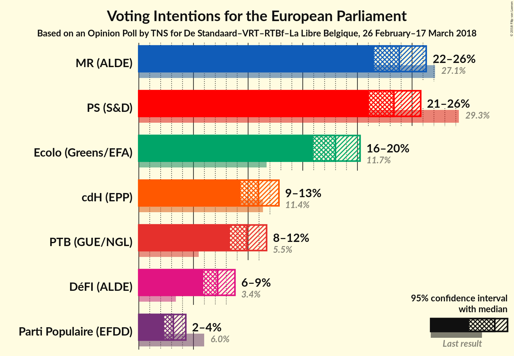

# Opinion Poll by TNS for De Standaard–VRT–RTBf–La Libre Belgique, 26 February–17 March 2018

Areas included: Brussels, Wallonia

<a href="#voting-intentions">Voting Intentions</a> | <a href="#seats">Seats</a> | <a href="#coalitions">Coalitions</a> | <a href="#technical-information">Technical Information</a>

## Voting Intentions

### Confidence Intervals

| Party | Last Result | Poll Result | 80% Confidence Interval | 90% Confidence Interval | 95% Confidence Interval | 99% Confidence Interval |
|:-----:|:-----------:|:-----------:|:-----------------------:|:-----------------------:|:-----------------------:|:-----------------------:|
| MR | N/A | 23.8% | 22.3–25.4% |21.9–25.9% |21.5–26.3% |20.8–27.1% |
| PS | N/A | 23.3% | 21.8–24.9% |21.4–25.4% |21.1–25.8% |20.4–26.6% |
| Ecolo | N/A | 18.0% | 16.6–19.5% |16.3–19.9% |15.9–20.2% |15.3–21.0% |
| cdH | N/A | 10.9% | 9.9–12.2% |9.6–12.5% |9.3–12.8% |8.8–13.4% |
| PTB | N/A | 9.9% | 8.9–11.1% |8.6–11.4% |8.3–11.7% |7.9–12.3% |
| DéFI | N/A | 7.2% | 6.3–8.2% |6.1–8.5% |5.9–8.8% |5.5–9.3% |
| Parti Populaire | N/A | 3.2% | 2.6–3.9% |2.5–4.1% |2.3–4.3% |2.1–4.7% |

*Note:* The poll result column reflects the actual value used in the calculations. Published results may vary slightly, and in addition be rounded to fewer digits.

## Seats

### Confidence Intervals

| Party | Last Result | Median | 80% Confidence Interval | 90% Confidence Interval | 95% Confidence Interval | 99% Confidence Interval |
|:-----:|:-----------:|:------:|:-----------------------:|:-----------------------:|:-----------------------:|:-----------------------:|
| <a href="#mr">MR</a> | N/A | 2 | 2 |2 |2 |2 |
| <a href="#ps">PS</a> | N/A | 2 | 2 |2 |2 |2 |
| <a href="#ecolo">Ecolo</a> | N/A | 2 | 2 |2 |2 |2 |
| <a href="#cdh">cdH</a> | N/A | 1 | 1 |1 |1 |1 |
| <a href="#ptb">PTB</a> | N/A | 1 | 1 |1 |1 |1 |
| <a href="#défi">DéFI</a> | N/A | 0 | 0 |0 |0 |0 |
| <a href="#parti-populaire">Parti Populaire</a> | N/A | 0 | 0 |0 |0 |0 |

