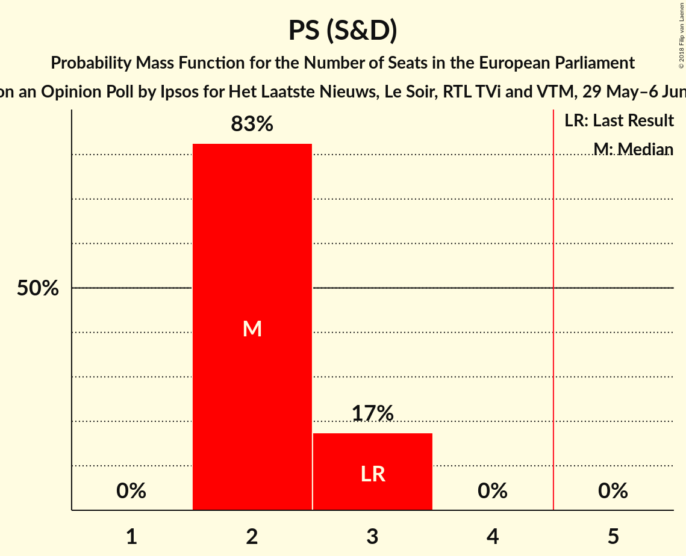
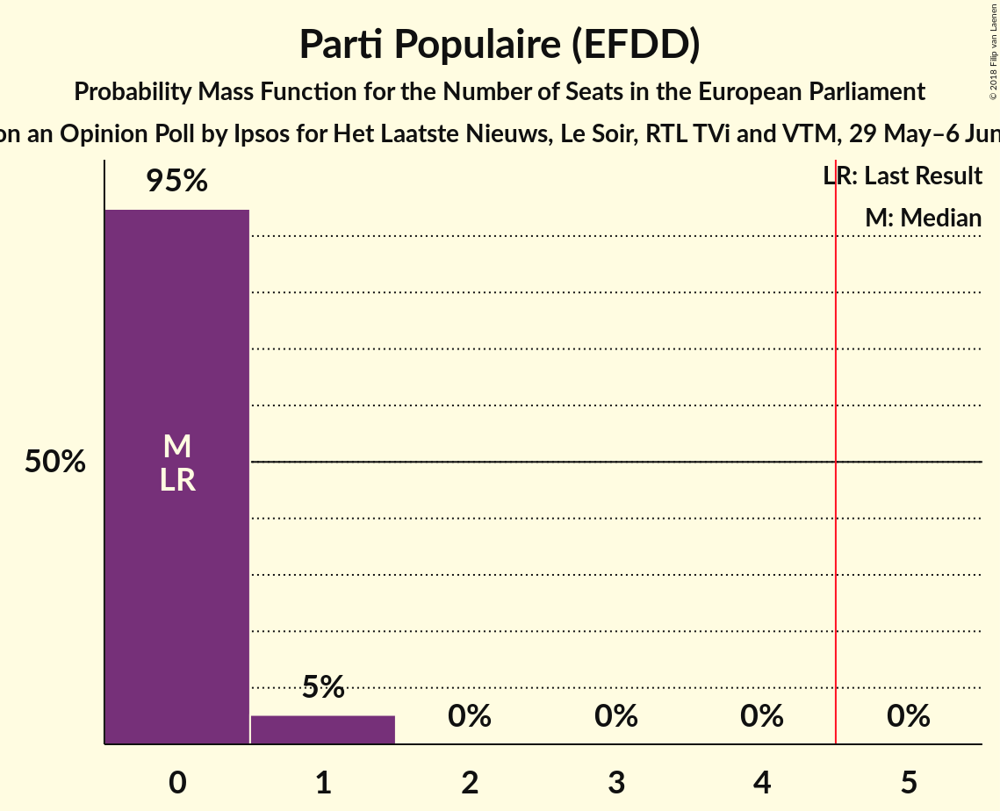
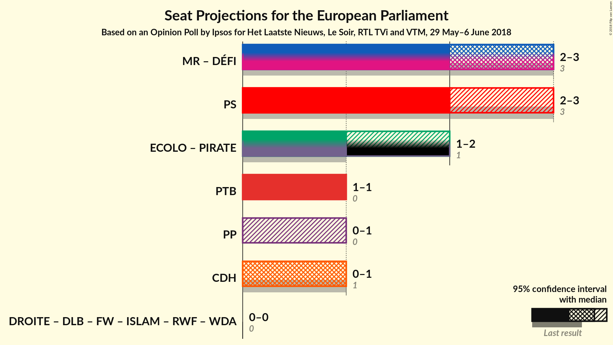

# Opinion Poll by Ipsos for Het Laatste Nieuws, Le Soir, RTL TVi and VTM, 29 May–6 June 2018

Areas included: Brussels, Wallonia

<a href="#voting-intentions">Voting Intentions</a> | <a href="#seats">Seats</a> | <a href="#coalitions">Coalitions</a> | <a href="#technical-information">Technical Information</a>

## Voting Intentions

### Confidence Intervals

| Party | Last Result | Poll Result | 80% Confidence Interval | 90% Confidence Interval | 95% Confidence Interval | 99% Confidence Interval |
|:-----:|:-----------:|:-----------:|:-----------------------:|:-----------------------:|:-----------------------:|:-----------------------:|
| PS (S&D) | 29.3% | 22.1% | 20.7–23.7% |20.3–24.2% |19.9–24.6% |19.2–25.4% |
| MR (ALDE) | 27.1% | 19.9% | 18.5–21.5% |18.1–21.9% |17.8–22.3% |17.1–23.0% |
| Ecolo (Greens/EFA) | 11.7% | 13.6% | 12.4–14.9% |12.0–15.3% |11.7–15.6% |11.2–16.3% |
| PTB (GUE/NGL) | 5.5% | 12.5% | 11.3–13.8% |11.0–14.1% |10.7–14.5% |10.2–15.1% |
| cdH (EPP) | 11.4% | 8.9% | 8.0–10.1% |7.7–10.4% |7.4–10.7% |7.0–11.2% |
| DéFI (ALDE) | 3.4% | 7.9% | 7.0–9.0% |6.8–9.3% |6.5–9.6% |6.1–10.2% |
| Parti Populaire (EFDD) | 6.0% | 6.5% | 5.7–7.5% |5.5–7.8% |5.3–8.1% |4.9–8.6% |
| La Droite (*) | 1.6% | 1.7% | 1.3–2.3% |1.2–2.5% |1.1–2.7% |1.0–3.0% |

*Note:* The poll result column reflects the actual value used in the calculations. Published results may vary slightly, and in addition be rounded to fewer digits.

## Seats

### Confidence Intervals

| Party | Last Result | Median | 80% Confidence Interval | 90% Confidence Interval | 95% Confidence Interval | 99% Confidence Interval |
|:-----:|:-----------:|:------:|:-----------------------:|:-----------------------:|:-----------------------:|:-----------------------:|
| <a href="#ps-(s&d)">PS (S&D)</a> | 3 | 2 | 2–3 |2–3 |2–3 |2–3 |
| <a href="#mr-(alde)">MR (ALDE)</a> | 3 | 2 | 2 |2 |2 |2–3 |
| <a href="#ecolo-(greens/efa)">Ecolo (Greens/EFA)</a> | 1 | 1 | 1 |1 |1–2 |1–2 |
| <a href="#ptb-(gue/ngl)">PTB (GUE/NGL)</a> | 0 | 1 | 1 |1 |1 |1–2 |
| <a href="#cdh-(epp)">cdH (EPP)</a> | 1 | 1 | 1 |0–1 |0–1 |0–1 |
| <a href="#défi-(alde)">DéFI (ALDE)</a> | 0 | 1 | 0–1 |0–1 |0–1 |0–1 |
| <a href="#parti-populaire-(efdd)">Parti Populaire (EFDD)</a> | 0 | 0 | 0 |0–1 |0–1 |0–1 |
| <a href="#la-droite-(*)">La Droite (*)</a> | 0 | 0 | 0 |0 |0 |0 |

### PS (S&D)

*For a full overview of the results for this party, see the [PS (S&D)](party-pssd.html) page.*

| Number of Seats | Probability | Accumulated | Special Marks |
|:---------------:|:-----------:|:-----------:|:-------------:|
| 2 | 83% | 100% | Median |
| 3 | 17% | 17% | Last Result |
| 4 | 0% | 0% |  |

### MR (ALDE)

*For a full overview of the results for this party, see the [MR (ALDE)](party-mralde.html) page.*

| Number of Seats | Probability | Accumulated | Special Marks |
|:---------------:|:-----------:|:-----------:|:-------------:|
| 2 | 98% | 100% | Median |
| 3 | 2% | 2% | Last Result |
| 4 | 0% | 0% |  |

### Ecolo (Greens/EFA)

*For a full overview of the results for this party, see the [Ecolo (Greens/EFA)](party-ecologreensefa.html) page.*

| Number of Seats | Probability | Accumulated | Special Marks |
|:---------------:|:-----------:|:-----------:|:-------------:|
| 1 | 96% | 100% | Last Result, Median |
| 2 | 4% | 4% |  |
| 3 | 0% | 0% |  |

### PTB (GUE/NGL)

*For a full overview of the results for this party, see the [PTB (GUE/NGL)](party-ptbguengl.html) page.*

| Number of Seats | Probability | Accumulated | Special Marks |
|:---------------:|:-----------:|:-----------:|:-------------:|
| 0 | 0% | 100% | Last Result |
| 1 | 99.5% | 100% | Median |
| 2 | 0.5% | 0.5% |  |
| 3 | 0% | 0% |  |

### cdH (EPP)

*For a full overview of the results for this party, see the [cdH (EPP)](party-cdhepp.html) page.*

| Number of Seats | Probability | Accumulated | Special Marks |
|:---------------:|:-----------:|:-----------:|:-------------:|
| 0 | 5% | 100% |  |
| 1 | 95% | 95% | Last Result, Median |
| 2 | 0% | 0% |  |

### DéFI (ALDE)

*For a full overview of the results for this party, see the [DéFI (ALDE)](party-défialde.html) page.*

| Number of Seats | Probability | Accumulated | Special Marks |
|:---------------:|:-----------:|:-----------:|:-------------:|
| 0 | 35% | 100% | Last Result |
| 1 | 65% | 65% | Median |
| 2 | 0% | 0% |  |

### Parti Populaire (EFDD)

*For a full overview of the results for this party, see the [Parti Populaire (EFDD)](party-partipopulaireefdd.html) page.*

| Number of Seats | Probability | Accumulated | Special Marks |
|:---------------:|:-----------:|:-----------:|:-------------:|
| 0 | 95% | 100% | Last Result, Median |
| 1 | 5% | 5% |  |
| 2 | 0% | 0% |  |

### La Droite (*)

*For a full overview of the results for this party, see the [La Droite (*)](party-ladroite.html) page.*

| Number of Seats | Probability | Accumulated | Special Marks |
|:---------------:|:-----------:|:-----------:|:-------------:|
| 0 | 100% | 100% | Last Result, Median |

## Coalitions

### Confidence Intervals

| Coalition | Last Result | Median | Majority? | 80% Confidence Interval | 90% Confidence Interval | 95% Confidence Interval | 99% Confidence Interval |
|:---------:|:-----------:|:------:|:---------:|:-----------------------:|:-----------------------:|:-----------------------:|:-----------------------:|
| MR (ALDE) – DéFI (ALDE) | 3 | 3 | 0% | 2–3 | 2–3 | 2–3 | 2–3 |
| PS (S&D) | 3 | 2 | 0% | 2–3 | 2–3 | 2–3 | 2–3 |
| PTB (GUE/NGL) | 0 | 1 | 0% | 1 | 1 | 1 | 1–2 |
| Parti Populaire (EFDD) | 0 | 0 | 0% | 0 | 0–1 | 0–1 | 0–1 |
| cdH (EPP) | 1 | 1 | 0% | 1 | 0–1 | 0–1 | 0–1 |

### MR (ALDE) – DéFI (ALDE)

| Number of Seats | Probability | Accumulated | Special Marks |
|:---------------:|:-----------:|:-----------:|:-------------:|
| 2 | 33% | 100% |  |
| 3 | 67% | 67% | Last Result, Median |
| 4 | 0.1% | 0.1% |  |
| 5 | 0% | 0% | Majority |

### PS (S&D)

| Number of Seats | Probability | Accumulated | Special Marks |
|:---------------:|:-----------:|:-----------:|:-------------:|
| 2 | 83% | 100% | Median |
| 3 | 17% | 17% | Last Result |
| 4 | 0% | 0% |  |

### PTB (GUE/NGL)

| Number of Seats | Probability | Accumulated | Special Marks |
|:---------------:|:-----------:|:-----------:|:-------------:|
| 0 | 0% | 100% | Last Result |
| 1 | 99.5% | 100% | Median |
| 2 | 0.5% | 0.5% |  |
| 3 | 0% | 0% |  |

### Parti Populaire (EFDD)

| Number of Seats | Probability | Accumulated | Special Marks |
|:---------------:|:-----------:|:-----------:|:-------------:|
| 0 | 95% | 100% | Last Result, Median |
| 1 | 5% | 5% |  |
| 2 | 0% | 0% |  |

### cdH (EPP)

| Number of Seats | Probability | Accumulated | Special Marks |
|:---------------:|:-----------:|:-----------:|:-------------:|
| 0 | 5% | 100% |  |
| 1 | 95% | 95% | Last Result, Median |
| 2 | 0% | 0% |  |

## Technical Information

### Opinion Poll

+ **Polling firm:** Ipsos
+ **Commissioner(s):** Het Laatste Nieuws, Le Soir, RTL TVi and VTM
+ **Fieldwork period:** 29 May–6 June 2018

### Calculations

+ **Sample size:** 1210
+ **Simulations done:** 1,048,576
+ **Error estimate:** 1.33%

