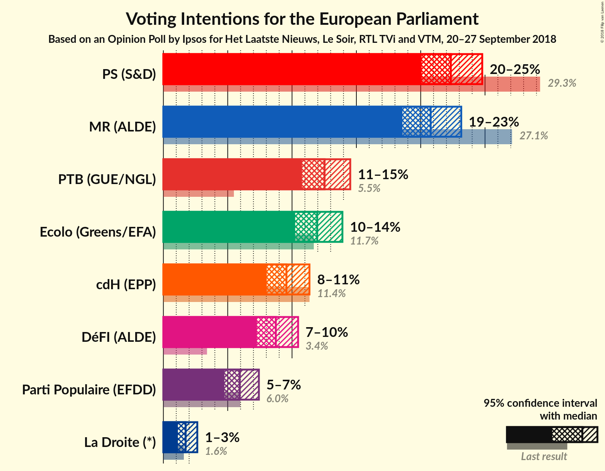
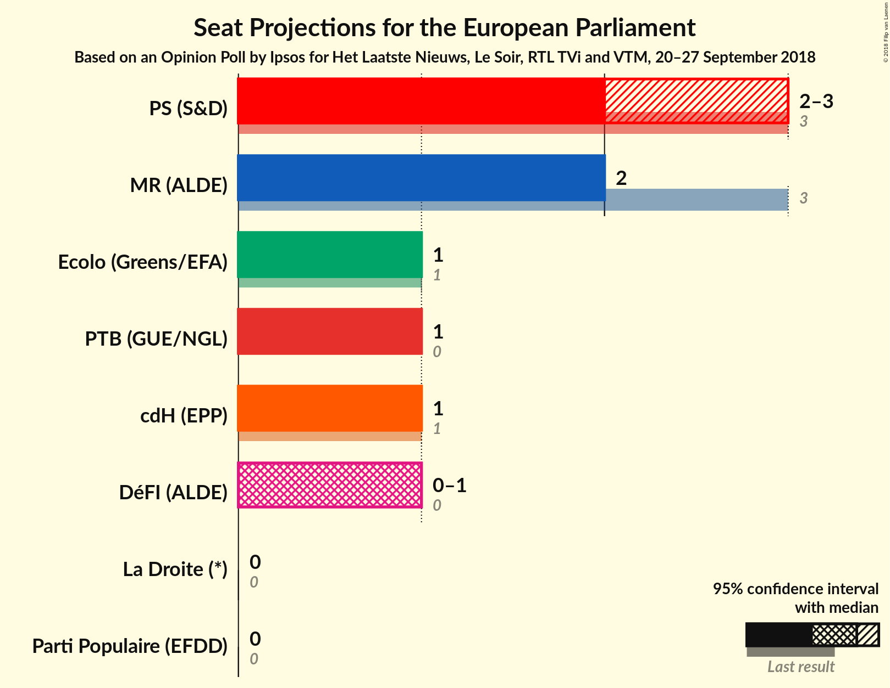
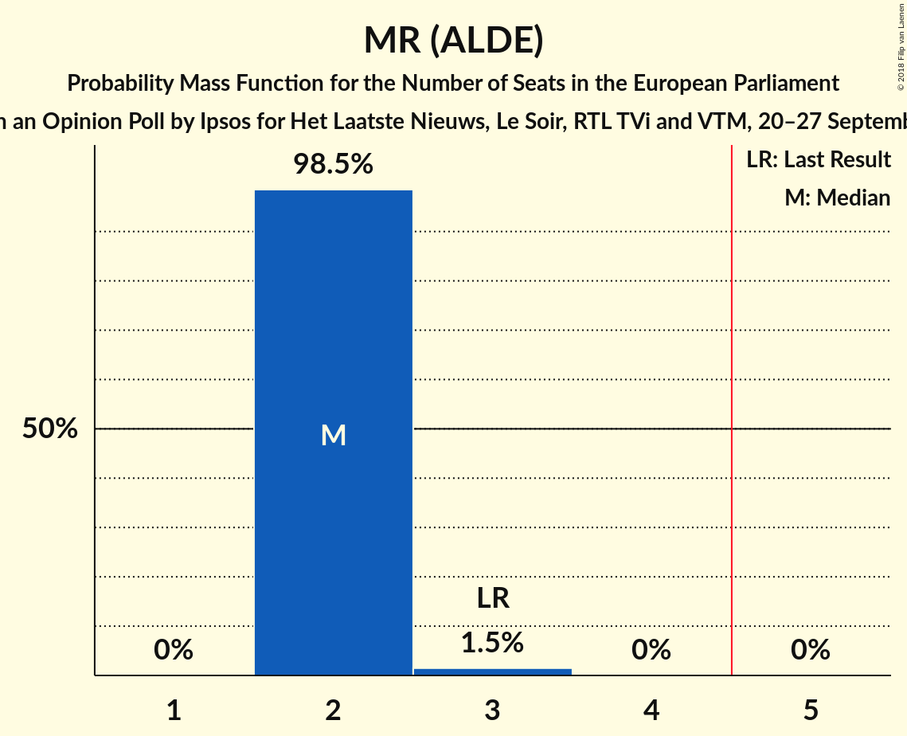
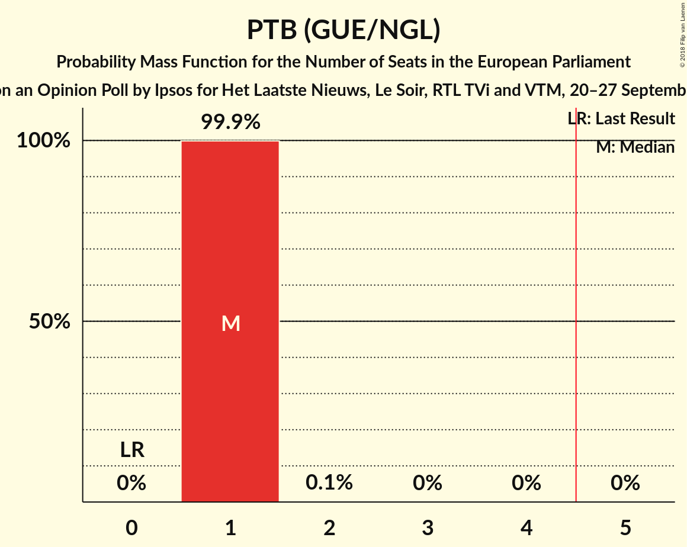
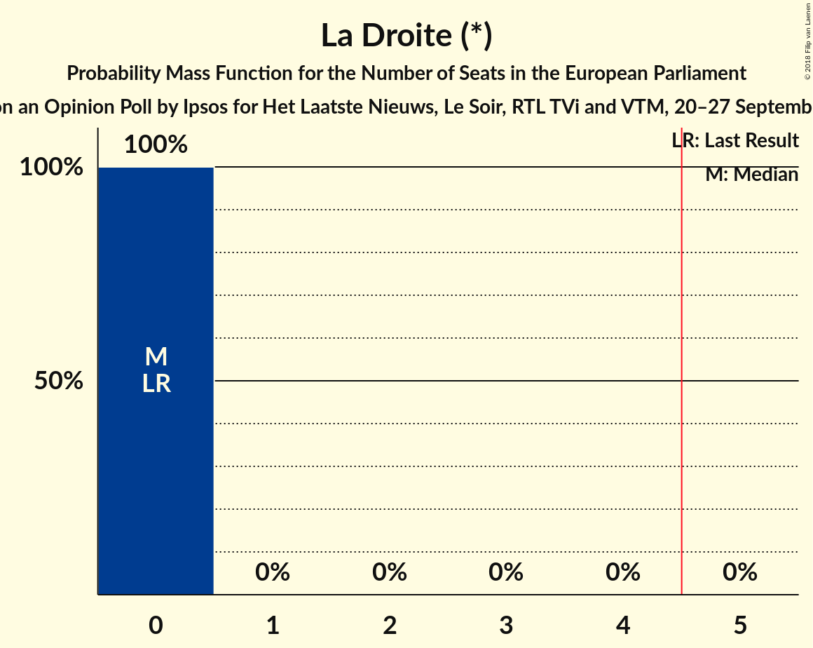

# Opinion Poll by Ipsos for Het Laatste Nieuws, Le Soir, RTL TVi and VTM, 20–27 September 2018

Areas included: Brussels, Wallonia

<a href="#voting-intentions">Voting Intentions</a> | <a href="#seats">Seats</a> | <a href="#coalitions">Coalitions</a> | <a href="#technical-information">Technical Information</a>

## Voting Intentions

### Confidence Intervals

| Party | Last Result | Poll Result | 80% Confidence Interval | 90% Confidence Interval | 95% Confidence Interval | 99% Confidence Interval |
|:-----:|:-----------:|:-----------:|:-----------------------:|:-----------------------:|:-----------------------:|:-----------------------:|
| PS (S&D) | 29.3% | 22.3% | 20.9–23.9% |20.4–24.4% |20.1–24.8% |19.4–25.6% |
| MR (ALDE) | 27.1% | 20.8% | 19.3–22.3% |18.9–22.8% |18.6–23.2% |17.9–23.9% |
| PTB (GUE/NGL) | 5.5% | 12.5% | 11.4–13.8% |11.1–14.2% |10.8–14.5% |10.3–15.2% |
| Ecolo (Greens/EFA) | 11.7% | 12.0% | 10.8–13.2% |10.5–13.6% |10.2–13.9% |9.7–14.5% |
| cdH (EPP) | 11.4% | 9.6% | 8.6–10.7% |8.3–11.1% |8.0–11.4% |7.6–11.9% |
| DéFI (ALDE) | 3.4% | 8.7% | 7.8–9.9% |7.5–10.2% |7.3–10.5% |6.8–11.0% |
| Parti Populaire (EFDD) | 6.0% | 5.9% | 5.2–6.9% |4.9–7.2% |4.7–7.4% |4.4–7.9% |
| La Droite (*) | 1.6% | 1.7% | 1.3–2.3% |1.2–2.5% |1.1–2.6% |1.0–3.0% |

*Note:* The poll result column reflects the actual value used in the calculations. Published results may vary slightly, and in addition be rounded to fewer digits.

## Seats

### Confidence Intervals

| Party | Last Result | Median | 80% Confidence Interval | 90% Confidence Interval | 95% Confidence Interval | 99% Confidence Interval |
|:-----:|:-----------:|:------:|:-----------------------:|:-----------------------:|:-----------------------:|:-----------------------:|
| <a href="#ps-(s&d)">PS (S&D)</a> | 3 | 2 | 2–3 |2–3 |2–3 |2–3 |
| <a href="#mr-(alde)">MR (ALDE)</a> | 3 | 2 | 2 |2 |2–3 |2–3 |
| <a href="#ptb-(gue/ngl)">PTB (GUE/NGL)</a> | 0 | 1 | 1 |1 |1 |1 |
| <a href="#ecolo-(greens/efa)">Ecolo (Greens/EFA)</a> | 1 | 1 | 1 |1 |1 |1 |
| <a href="#cdh-(epp)">cdH (EPP)</a> | 1 | 1 | 1 |1 |1 |0–1 |
| <a href="#défi-(alde)">DéFI (ALDE)</a> | 0 | 1 | 0–1 |0–1 |0–1 |0–1 |
| <a href="#parti-populaire-(efdd)">Parti Populaire (EFDD)</a> | 0 | 0 | 0 |0 |0 |0 |
| <a href="#la-droite-(*)">La Droite (*)</a> | 0 | 0 | 0 |0 |0 |0 |

### PS (S&D)

*For a full overview of the results for this party, see the [PS (S&D)](party-pssd.html) page.*

| Number of Seats | Probability | Accumulated | Special Marks |
|:---------------:|:-----------:|:-----------:|:-------------:|
| 2 | 89% | 100% | Median |
| 3 | 11% | 11% | Last Result |
| 4 | 0% | 0% |  |

### MR (ALDE)

*For a full overview of the results for this party, see the [MR (ALDE)](party-mralde.html) page.*

| Number of Seats | Probability | Accumulated | Special Marks |
|:---------------:|:-----------:|:-----------:|:-------------:|
| 2 | 97% | 100% | Median |
| 3 | 3% | 3% | Last Result |
| 4 | 0% | 0% |  |

### PTB (GUE/NGL)

*For a full overview of the results for this party, see the [PTB (GUE/NGL)](party-ptbguengl.html) page.*

| Number of Seats | Probability | Accumulated | Special Marks |
|:---------------:|:-----------:|:-----------:|:-------------:|
| 0 | 0% | 100% | Last Result |
| 1 | 100% | 100% | Median |

### Ecolo (Greens/EFA)

*For a full overview of the results for this party, see the [Ecolo (Greens/EFA)](party-ecologreensefa.html) page.*

| Number of Seats | Probability | Accumulated | Special Marks |
|:---------------:|:-----------:|:-----------:|:-------------:|
| 1 | 99.9% | 100% | Last Result, Median |
| 2 | 0.1% | 0.1% |  |
| 3 | 0% | 0% |  |

### cdH (EPP)

*For a full overview of the results for this party, see the [cdH (EPP)](party-cdhepp.html) page.*

| Number of Seats | Probability | Accumulated | Special Marks |
|:---------------:|:-----------:|:-----------:|:-------------:|
| 0 | 1.3% | 100% |  |
| 1 | 98.7% | 98.7% | Last Result, Median |
| 2 | 0% | 0% |  |

### DéFI (ALDE)

*For a full overview of the results for this party, see the [DéFI (ALDE)](party-défialde.html) page.*

| Number of Seats | Probability | Accumulated | Special Marks |
|:---------------:|:-----------:|:-----------:|:-------------:|
| 0 | 15% | 100% | Last Result |
| 1 | 85% | 85% | Median |
| 2 | 0% | 0% |  |

### Parti Populaire (EFDD)

*For a full overview of the results for this party, see the [Parti Populaire (EFDD)](party-partipopulaireefdd.html) page.*

| Number of Seats | Probability | Accumulated | Special Marks |
|:---------------:|:-----------:|:-----------:|:-------------:|
| 0 | 99.7% | 100% | Last Result, Median |
| 1 | 0.3% | 0.3% |  |
| 2 | 0% | 0% |  |

### La Droite (*)

*For a full overview of the results for this party, see the [La Droite (*)](party-ladroite.html) page.*

| Number of Seats | Probability | Accumulated | Special Marks |
|:---------------:|:-----------:|:-----------:|:-------------:|
| 0 | 100% | 100% | Last Result, Median |

## Coalitions

### Confidence Intervals

| Coalition | Last Result | Median | Majority? | 80% Confidence Interval | 90% Confidence Interval | 95% Confidence Interval | 99% Confidence Interval |
|:---------:|:-----------:|:------:|:---------:|:-----------------------:|:-----------------------:|:-----------------------:|:-----------------------:|
| MR (ALDE) – DéFI (ALDE) | 3 | 3 | 0% | 2–3 | 2–3 | 2–3 | 2–3 |
| PS (S&D) | 3 | 2 | 0% | 2–3 | 2–3 | 2–3 | 2–3 |
| PTB (GUE/NGL) | 0 | 1 | 0% | 1 | 1 | 1 | 1 |
| cdH (EPP) | 1 | 1 | 0% | 1 | 1 | 1 | 0–1 |
| Parti Populaire (EFDD) | 0 | 0 | 0% | 0 | 0 | 0 | 0 |

### MR (ALDE) – DéFI (ALDE)

| Number of Seats | Probability | Accumulated | Special Marks |
|:---------------:|:-----------:|:-----------:|:-------------:|
| 2 | 12% | 100% |  |
| 3 | 88% | 88% | Last Result, Median |
| 4 | 0.1% | 0.1% |  |
| 5 | 0% | 0% | Majority |

### PS (S&D)

| Number of Seats | Probability | Accumulated | Special Marks |
|:---------------:|:-----------:|:-----------:|:-------------:|
| 2 | 89% | 100% | Median |
| 3 | 11% | 11% | Last Result |
| 4 | 0% | 0% |  |

### PTB (GUE/NGL)

| Number of Seats | Probability | Accumulated | Special Marks |
|:---------------:|:-----------:|:-----------:|:-------------:|
| 0 | 0% | 100% | Last Result |
| 1 | 100% | 100% | Median |

### cdH (EPP)

| Number of Seats | Probability | Accumulated | Special Marks |
|:---------------:|:-----------:|:-----------:|:-------------:|
| 0 | 1.3% | 100% |  |
| 1 | 98.7% | 98.7% | Last Result, Median |
| 2 | 0% | 0% |  |

### Parti Populaire (EFDD)

| Number of Seats | Probability | Accumulated | Special Marks |
|:---------------:|:-----------:|:-----------:|:-------------:|
| 0 | 99.7% | 100% | Last Result, Median |
| 1 | 0.3% | 0.3% |  |
| 2 | 0% | 0% |  |

## Technical Information

### Opinion Poll

+ **Polling firm:** Ipsos
+ **Commissioner(s):** Het Laatste Nieuws, Le Soir, RTL TVi and VTM
+ **Fieldwork period:** 20–27 September 2018

### Calculations

+ **Sample size:** 1213
+ **Simulations done:** 131,072
+ **Error estimate:** 2.33%

