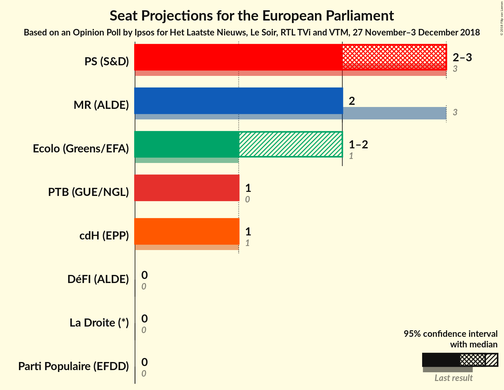
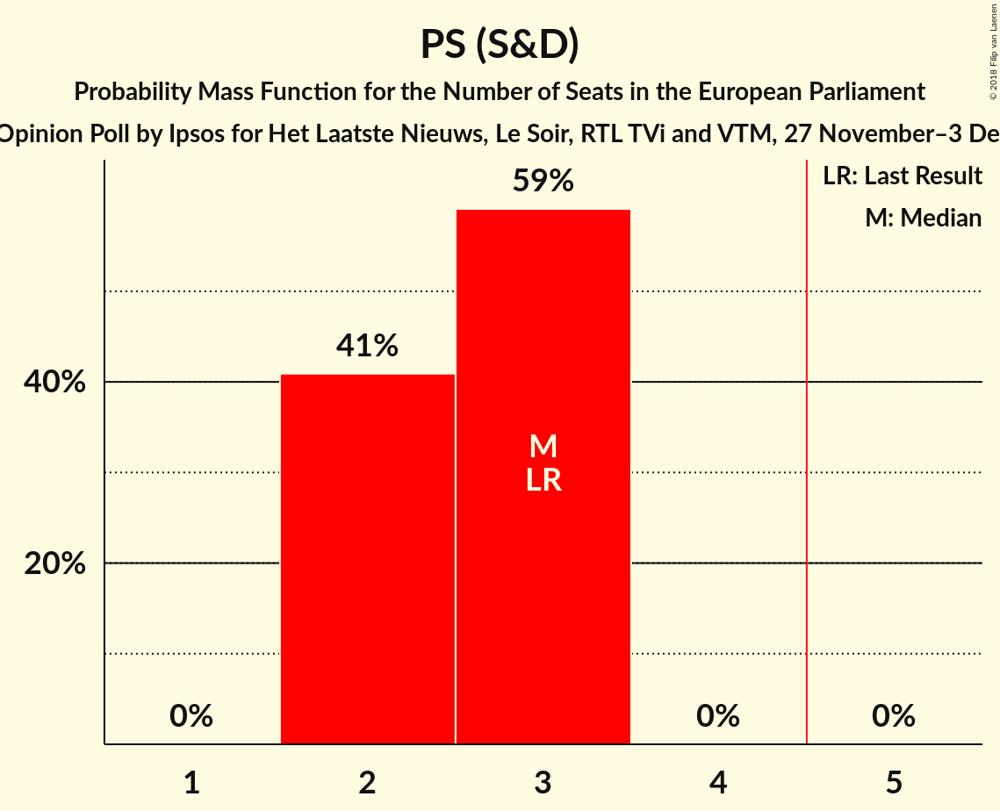
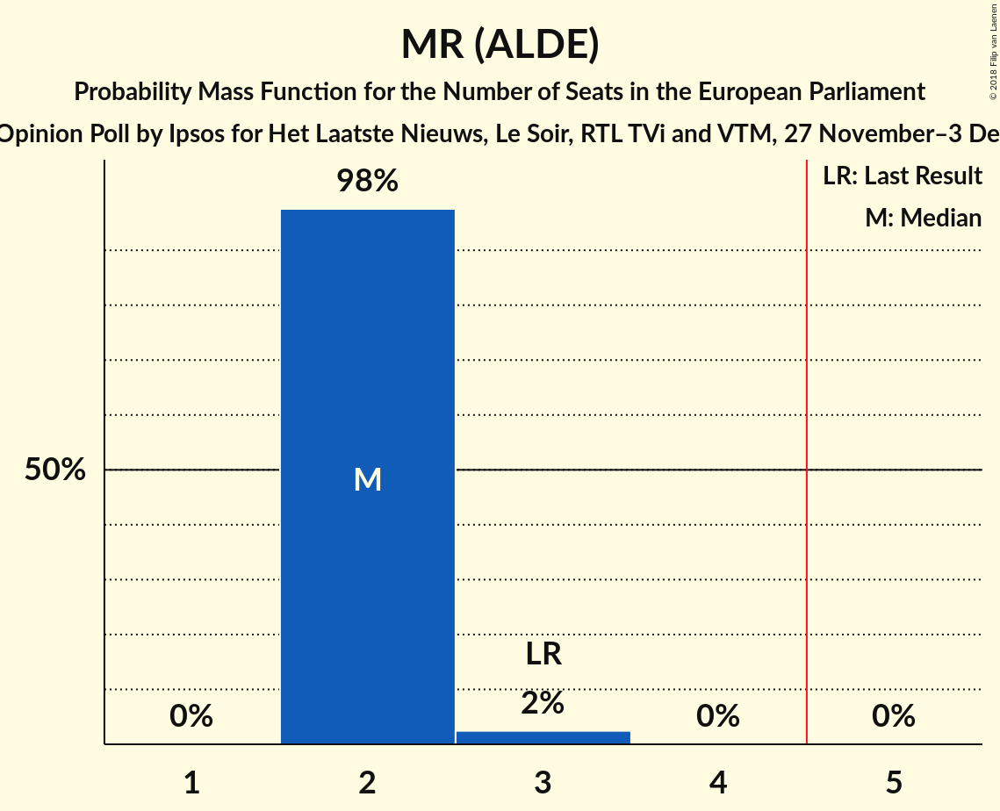
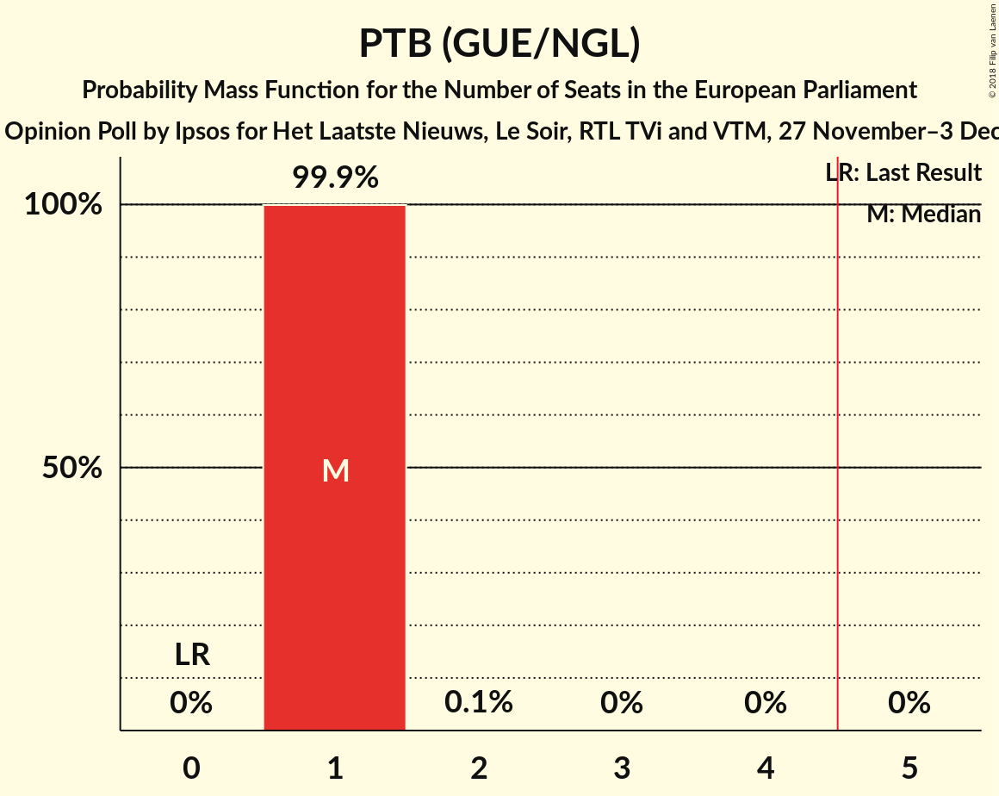
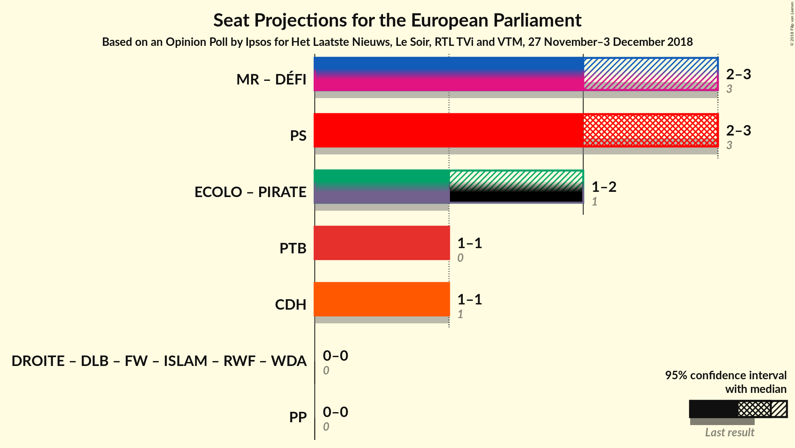

# Opinion Poll by Ipsos for Het Laatste Nieuws, Le Soir, RTL TVi and VTM, 27 November–3 December 2018

Areas included: Brussels, Wallonia

<a href="#voting-intentions">Voting Intentions</a> | <a href="#seats">Seats</a> | <a href="#coalitions">Coalitions</a> | <a href="#technical-information">Technical Information</a>

## Voting Intentions

### Confidence Intervals

| Party | Last Result | Poll Result | 80% Confidence Interval | 90% Confidence Interval | 95% Confidence Interval | 99% Confidence Interval |
|:-----:|:-----------:|:-----------:|:-----------------------:|:-----------------------:|:-----------------------:|:-----------------------:|
| PS (S&D) | 29.3% | 23.5% | 22.0–25.1% |21.6–25.6% |21.2–26.0% |20.5–26.8% |
| MR (ALDE) | 27.1% | 20.6% | 19.2–22.2% |18.8–22.6% |18.5–23.0% |17.8–23.8% |
| Ecolo (Greens/EFA) | 11.7% | 15.2% | 13.9–16.5% |13.5–16.9% |13.2–17.3% |12.7–18.0% |
| PTB (GUE/NGL) | 5.5% | 11.9% | 10.8–13.1% |10.4–13.5% |10.2–13.8% |9.7–14.4% |
| cdH (EPP) | 11.4% | 10.2% | 9.1–11.4% |8.8–11.7% |8.6–12.0% |8.1–12.6% |
| DéFI (ALDE) | 3.4% | 6.3% | 5.5–7.3% |5.3–7.6% |5.1–7.8% |4.7–8.3% |
| Parti Populaire (EFDD) | 6.0% | 5.8% | 5.0–6.8% |4.8–7.0% |4.6–7.3% |4.3–7.8% |
| La Droite (*) | 1.6% | 1.9% | 1.5–2.5% |1.4–2.7% |1.2–2.8% |1.1–3.1% |

*Note:* The poll result column reflects the actual value used in the calculations. Published results may vary slightly, and in addition be rounded to fewer digits.

## Seats

### Confidence Intervals

| Party | Last Result | Median | 80% Confidence Interval | 90% Confidence Interval | 95% Confidence Interval | 99% Confidence Interval |
|:-----:|:-----------:|:------:|:-----------------------:|:-----------------------:|:-----------------------:|:-----------------------:|
| <a href="#ps-(s&d)">PS (S&D)</a> | 3 | 2 | 2 |2–3 |2–3 |2–3 |
| <a href="#mr-(alde)">MR (ALDE)</a> | 3 | 2 | 2 |2 |2 |2 |
| <a href="#ecolo-(greens/efa)">Ecolo (Greens/EFA)</a> | 1 | 2 | 2 |1–2 |1–2 |1–2 |
| <a href="#ptb-(gue/ngl)">PTB (GUE/NGL)</a> | 0 | 1 | 1 |1 |1 |1 |
| <a href="#cdh-(epp)">cdH (EPP)</a> | 1 | 1 | 1 |1 |1 |1 |
| <a href="#défi-(alde)">DéFI (ALDE)</a> | 0 | 0 | 0 |0 |0 |0 |
| <a href="#parti-populaire-(efdd)">Parti Populaire (EFDD)</a> | 0 | 0 | 0 |0 |0 |0 |
| <a href="#la-droite-(*)">La Droite (*)</a> | 0 | 0 | 0 |0 |0 |0 |

### PS (S&D)

*For a full overview of the results for this party, see the [PS (S&D)](party-pssd.html) page.*

| Number of Seats | Probability | Accumulated | Special Marks |
|:---------------:|:-----------:|:-----------:|:-------------:|
| 2 | 91% | 100% | Median |
| 3 | 9% | 9% | Last Result |
| 4 | 0% | 0% |  |

### MR (ALDE)

*For a full overview of the results for this party, see the [MR (ALDE)](party-mralde.html) page.*

| Number of Seats | Probability | Accumulated | Special Marks |
|:---------------:|:-----------:|:-----------:|:-------------:|
| 2 | 100% | 100% | Median |
| 3 | 0% | 0% | Last Result |

### Ecolo (Greens/EFA)

*For a full overview of the results for this party, see the [Ecolo (Greens/EFA)](party-ecologreensefa.html) page.*

| Number of Seats | Probability | Accumulated | Special Marks |
|:---------------:|:-----------:|:-----------:|:-------------:|
| 1 | 9% | 100% | Last Result |
| 2 | 91% | 91% | Median |
| 3 | 0% | 0% |  |

### PTB (GUE/NGL)

*For a full overview of the results for this party, see the [PTB (GUE/NGL)](party-ptbguengl.html) page.*

| Number of Seats | Probability | Accumulated | Special Marks |
|:---------------:|:-----------:|:-----------:|:-------------:|
| 0 | 0% | 100% | Last Result |
| 1 | 99.6% | 100% | Median |
| 2 | 0.4% | 0.4% |  |
| 3 | 0% | 0% |  |

### cdH (EPP)

*For a full overview of the results for this party, see the [cdH (EPP)](party-cdhepp.html) page.*

| Number of Seats | Probability | Accumulated | Special Marks |
|:---------------:|:-----------:|:-----------:|:-------------:|
| 1 | 100% | 100% | Last Result, Median |

### DéFI (ALDE)

*For a full overview of the results for this party, see the [DéFI (ALDE)](party-défialde.html) page.*

| Number of Seats | Probability | Accumulated | Special Marks |
|:---------------:|:-----------:|:-----------:|:-------------:|
| 0 | 100% | 100% | Last Result, Median |

### Parti Populaire (EFDD)

*For a full overview of the results for this party, see the [Parti Populaire (EFDD)](party-partipopulaireefdd.html) page.*

| Number of Seats | Probability | Accumulated | Special Marks |
|:---------------:|:-----------:|:-----------:|:-------------:|
| 0 | 99.9% | 100% | Last Result, Median |
| 1 | 0.1% | 0.1% |  |
| 2 | 0% | 0% |  |

### La Droite (*)

*For a full overview of the results for this party, see the [La Droite (*)](party-ladroite.html) page.*

| Number of Seats | Probability | Accumulated | Special Marks |
|:---------------:|:-----------:|:-----------:|:-------------:|
| 0 | 100% | 100% | Last Result, Median |

## Coalitions

### Confidence Intervals

| Coalition | Last Result | Median | Majority? | 80% Confidence Interval | 90% Confidence Interval | 95% Confidence Interval | 99% Confidence Interval |
|:---------:|:-----------:|:------:|:---------:|:-----------------------:|:-----------------------:|:-----------------------:|:-----------------------:|
| PS (S&D) | 3 | 2 | 0% | 2 | 2–3 | 2–3 | 2–3 |
| MR (ALDE) – DéFI (ALDE) | 3 | 2 | 0% | 2 | 2 | 2 | 2 |
| PTB (GUE/NGL) | 0 | 1 | 0% | 1 | 1 | 1 | 1 |
| cdH (EPP) | 1 | 1 | 0% | 1 | 1 | 1 | 1 |
| Parti Populaire (EFDD) | 0 | 0 | 0% | 0 | 0 | 0 | 0 |

### PS (S&D)

| Number of Seats | Probability | Accumulated | Special Marks |
|:---------------:|:-----------:|:-----------:|:-------------:|
| 2 | 91% | 100% | Median |
| 3 | 9% | 9% | Last Result |
| 4 | 0% | 0% |  |

### MR (ALDE) – DéFI (ALDE)

| Number of Seats | Probability | Accumulated | Special Marks |
|:---------------:|:-----------:|:-----------:|:-------------:|
| 2 | 100% | 100% | Median |
| 3 | 0% | 0% | Last Result |

### PTB (GUE/NGL)

| Number of Seats | Probability | Accumulated | Special Marks |
|:---------------:|:-----------:|:-----------:|:-------------:|
| 0 | 0% | 100% | Last Result |
| 1 | 99.6% | 100% | Median |
| 2 | 0.4% | 0.4% |  |
| 3 | 0% | 0% |  |

### cdH (EPP)

| Number of Seats | Probability | Accumulated | Special Marks |
|:---------------:|:-----------:|:-----------:|:-------------:|
| 1 | 100% | 100% | Last Result, Median |

### Parti Populaire (EFDD)

| Number of Seats | Probability | Accumulated | Special Marks |
|:---------------:|:-----------:|:-----------:|:-------------:|
| 0 | 99.9% | 100% | Last Result, Median |
| 1 | 0.1% | 0.1% |  |
| 2 | 0% | 0% |  |

## Technical Information

### Opinion Poll

+ **Polling firm:** Ipsos
+ **Commissioner(s):** Het Laatste Nieuws, Le Soir, RTL TVi and VTM
+ **Fieldwork period:** 27 November–3 December 2018

### Calculations

+ **Sample size:** 1221
+ **Simulations done:** 1,024
+ **Error estimate:** 3.14%

