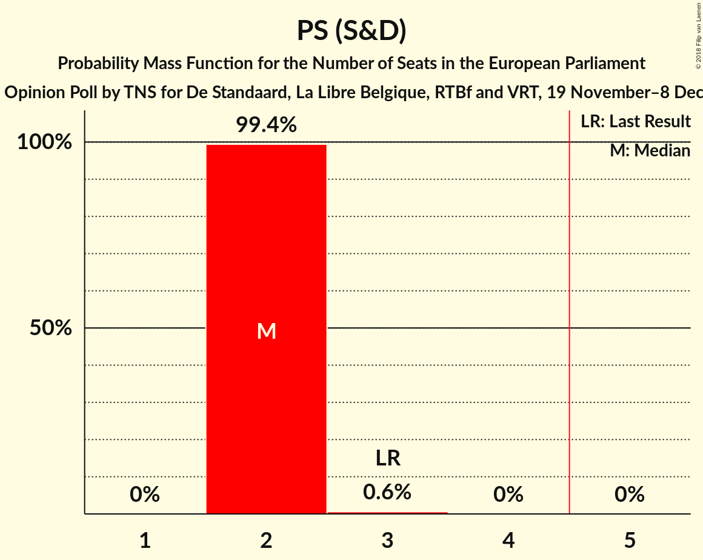
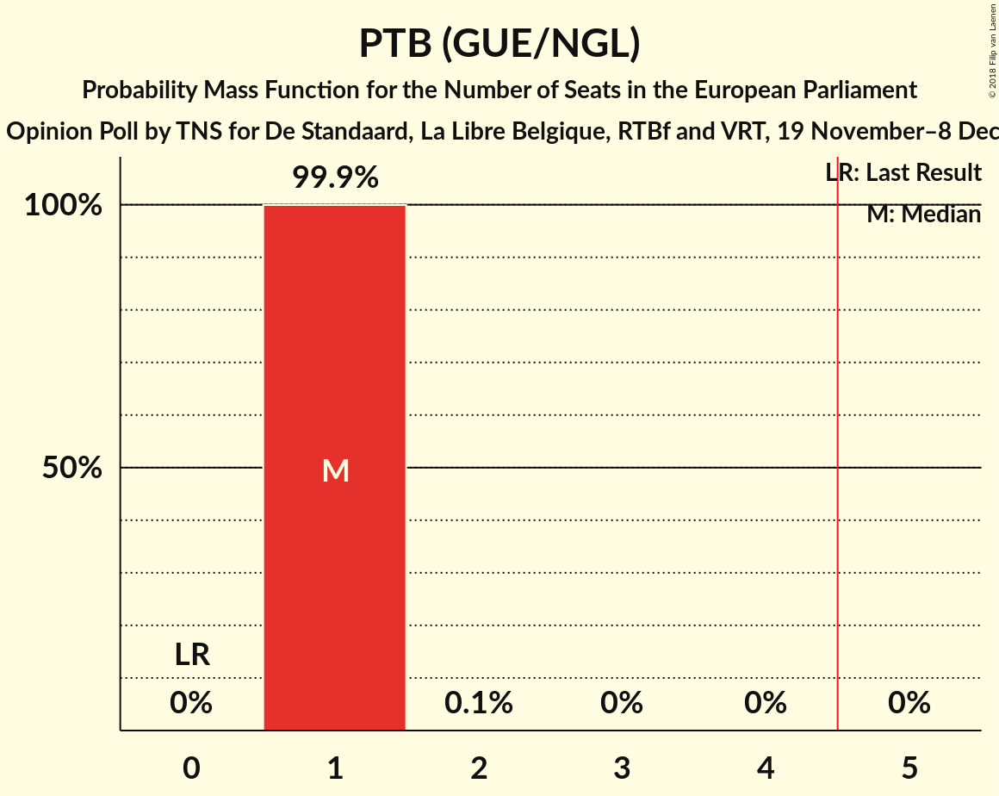

# Opinion Poll by TNS for De Standaard, La Libre Belgique, RTBf and VRT, 19 November–8 December 2018

Areas included: Brussels, Wallonia

<a href="#voting-intentions">Voting Intentions</a> | <a href="#seats">Seats</a> | <a href="#coalitions">Coalitions</a> | <a href="#technical-information">Technical Information</a>

## Voting Intentions

### Confidence Intervals

| Party | Last Result | Poll Result | 80% Confidence Interval | 90% Confidence Interval | 95% Confidence Interval | 99% Confidence Interval |
|:-----:|:-----------:|:-----------:|:-----------------------:|:-----------------------:|:-----------------------:|:-----------------------:|
| PS (S&D) | 29.3% | 24.1% | 22.6–25.7% |22.2–26.2% |21.8–26.6% |21.1–27.4% |
| Ecolo (Greens/EFA) | 11.7% | 20.9% | 19.4–22.4% |19.0–22.8% |18.7–23.2% |18.0–24.0% |
| MR (ALDE) | 27.1% | 19.9% | 18.5–21.4% |18.1–21.8% |17.7–22.2% |17.1–23.0% |
| PTB (GUE/NGL) | 5.5% | 13.9% | 12.7–15.2% |12.3–15.6% |12.0–15.9% |11.5–16.6% |
| cdH (EPP) | 11.4% | 9.8% | 8.8–11.0% |8.5–11.3% |8.2–11.6% |7.8–12.2% |
| DéFI (ALDE) | 3.4% | 4.8% | 4.1–5.7% |3.9–5.9% |3.7–6.2% |3.4–6.6% |
| Parti Populaire (EFDD) | 6.0% | 4.6% | 3.9–5.4% |3.7–5.7% |3.5–5.9% |3.2–6.3% |

*Note:* The poll result column reflects the actual value used in the calculations. Published results may vary slightly, and in addition be rounded to fewer digits.

## Seats

### Confidence Intervals

| Party | Last Result | Median | 80% Confidence Interval | 90% Confidence Interval | 95% Confidence Interval | 99% Confidence Interval |
|:-----:|:-----------:|:------:|:-----------------------:|:-----------------------:|:-----------------------:|:-----------------------:|
| <a href="#ps-(s&d)">PS (S&D)</a> | 3 | 2 | 2 |2 |2 |2 |
| <a href="#ecolo-(greens/efa)">Ecolo (Greens/EFA)</a> | 1 | 2 | 2 |2 |2 |2 |
| <a href="#mr-(alde)">MR (ALDE)</a> | 3 | 2 | 2 |2 |2 |2 |
| <a href="#ptb-(gue/ngl)">PTB (GUE/NGL)</a> | 0 | 1 | 1 |1 |1 |1 |
| <a href="#cdh-(epp)">cdH (EPP)</a> | 1 | 1 | 1 |1 |1 |1 |
| <a href="#défi-(alde)">DéFI (ALDE)</a> | 0 | 0 | 0 |0 |0 |0 |
| <a href="#parti-populaire-(efdd)">Parti Populaire (EFDD)</a> | 0 | 0 | 0 |0 |0 |0 |

### PS (S&D)

*For a full overview of the results for this party, see the [PS (S&D)](party-pssd.html) page.*

| Number of Seats | Probability | Accumulated | Special Marks |
|:---------------:|:-----------:|:-----------:|:-------------:|
| 2 | 99.9% | 100% | Median |
| 3 | 0.1% | 0.1% | Last Result |
| 4 | 0% | 0% |  |

### Ecolo (Greens/EFA)

*For a full overview of the results for this party, see the [Ecolo (Greens/EFA)](party-ecologreensefa.html) page.*

| Number of Seats | Probability | Accumulated | Special Marks |
|:---------------:|:-----------:|:-----------:|:-------------:|
| 1 | 0% | 100% | Last Result |
| 2 | 99.9% | 100% | Median |
| 3 | 0.1% | 0.1% |  |
| 4 | 0% | 0% |  |

### MR (ALDE)

*For a full overview of the results for this party, see the [MR (ALDE)](party-mralde.html) page.*

| Number of Seats | Probability | Accumulated | Special Marks |
|:---------------:|:-----------:|:-----------:|:-------------:|
| 1 | 0.1% | 100% |  |
| 2 | 99.9% | 99.9% | Median |
| 3 | 0% | 0% | Last Result |

### PTB (GUE/NGL)

*For a full overview of the results for this party, see the [PTB (GUE/NGL)](party-ptbguengl.html) page.*

| Number of Seats | Probability | Accumulated | Special Marks |
|:---------------:|:-----------:|:-----------:|:-------------:|
| 0 | 0% | 100% | Last Result |
| 1 | 100% | 100% | Median |

### cdH (EPP)

*For a full overview of the results for this party, see the [cdH (EPP)](party-cdhepp.html) page.*

| Number of Seats | Probability | Accumulated | Special Marks |
|:---------------:|:-----------:|:-----------:|:-------------:|
| 0 | 0.1% | 100% |  |
| 1 | 99.9% | 99.9% | Last Result, Median |
| 2 | 0% | 0% |  |

### DéFI (ALDE)

*For a full overview of the results for this party, see the [DéFI (ALDE)](party-défialde.html) page.*

| Number of Seats | Probability | Accumulated | Special Marks |
|:---------------:|:-----------:|:-----------:|:-------------:|
| 0 | 100% | 100% | Last Result, Median |

### Parti Populaire (EFDD)

*For a full overview of the results for this party, see the [Parti Populaire (EFDD)](party-partipopulaireefdd.html) page.*

| Number of Seats | Probability | Accumulated | Special Marks |
|:---------------:|:-----------:|:-----------:|:-------------:|
| 0 | 100% | 100% | Last Result, Median |

## Coalitions

### Confidence Intervals

| Coalition | Last Result | Median | Majority? | 80% Confidence Interval | 90% Confidence Interval | 95% Confidence Interval | 99% Confidence Interval |
|:---------:|:-----------:|:------:|:---------:|:-----------------------:|:-----------------------:|:-----------------------:|:-----------------------:|
| MR (ALDE) – DéFI (ALDE) | 3 | 2 | 0% | 2 | 2 | 2 | 2 |
| PS (S&D) | 3 | 2 | 0% | 2 | 2 | 2 | 2 |
| PTB (GUE/NGL) | 0 | 1 | 0% | 1 | 1 | 1 | 1 |
| cdH (EPP) | 1 | 1 | 0% | 1 | 1 | 1 | 1 |
| Parti Populaire (EFDD) | 0 | 0 | 0% | 0 | 0 | 0 | 0 |

### MR (ALDE) – DéFI (ALDE)

| Number of Seats | Probability | Accumulated | Special Marks |
|:---------------:|:-----------:|:-----------:|:-------------:|
| 1 | 0.1% | 100% |  |
| 2 | 99.9% | 99.9% | Median |
| 3 | 0% | 0% | Last Result |

### PS (S&D)

| Number of Seats | Probability | Accumulated | Special Marks |
|:---------------:|:-----------:|:-----------:|:-------------:|
| 2 | 99.9% | 100% | Median |
| 3 | 0.1% | 0.1% | Last Result |
| 4 | 0% | 0% |  |

### PTB (GUE/NGL)

| Number of Seats | Probability | Accumulated | Special Marks |
|:---------------:|:-----------:|:-----------:|:-------------:|
| 0 | 0% | 100% | Last Result |
| 1 | 100% | 100% | Median |

### cdH (EPP)

| Number of Seats | Probability | Accumulated | Special Marks |
|:---------------:|:-----------:|:-----------:|:-------------:|
| 0 | 0.1% | 100% |  |
| 1 | 99.9% | 99.9% | Last Result, Median |
| 2 | 0% | 0% |  |

### Parti Populaire (EFDD)

| Number of Seats | Probability | Accumulated | Special Marks |
|:---------------:|:-----------:|:-----------:|:-------------:|
| 0 | 100% | 100% | Last Result, Median |

## Technical Information

### Opinion Poll

+ **Polling firm:** TNS
+ **Commissioner(s):** De Standaard, La Libre Belgique, RTBf and VRT
+ **Fieldwork period:** 19 November–8 December 2018

### Calculations

+ **Sample size:** 1227
+ **Simulations done:** 1,024
+ **Error estimate:** 2.88%

