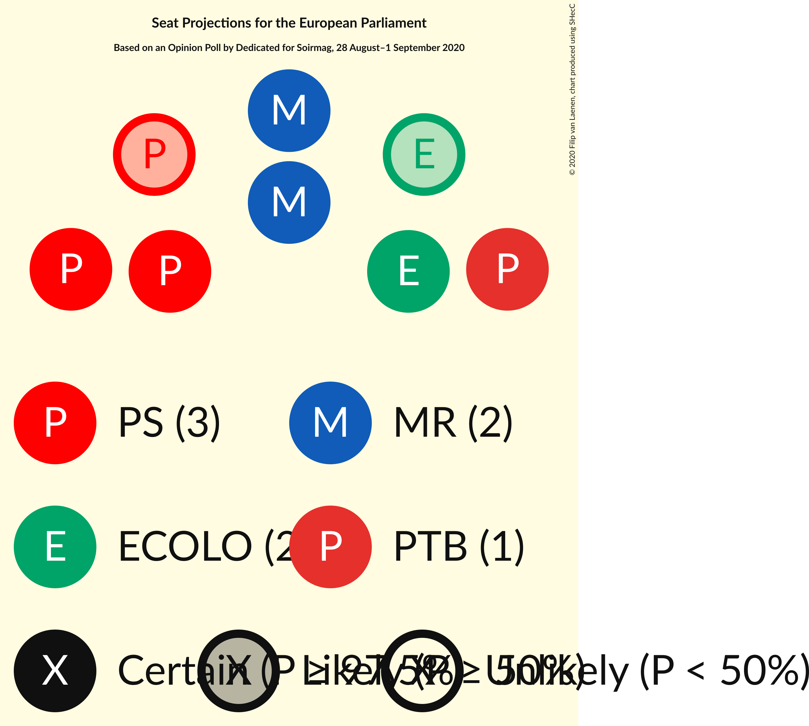

# Opinion Poll by Dedicated for Soirmag, 28 August–1 September 2020

Areas included: Brussels, Wallonia

<a href="#voting-intentions">Voting Intentions</a> | <a href="#seats">Seats</a> | <a href="#coalitions">Coalitions</a> | <a href="#technical-information">Technical Information</a>

## Voting Intentions

### Confidence Intervals

| Party | Last Result | Poll Result | 80% Confidence Interval | 90% Confidence Interval | 95% Confidence Interval | 99% Confidence Interval |
|:-----:|:-----------:|:-----------:|:-----------------------:|:-----------------------:|:-----------------------:|:-----------------------:|
| Parti Socialiste (S&D) | 29.3% | 25.8% | 22.8–29.0% |22.0–29.9% |21.3–30.7% |20.0–32.3% |
| Mouvement Réformateur (RE) | 27.1% | 23.0% | 20.3–26.2% |19.5–27.1% |18.8–27.9% |17.5–29.4% |
| Ecolo (Greens/EFA) | 11.7% | 17.0% | 14.6–19.9% |13.9–20.7% |13.3–21.4% |12.2–22.8% |
| Parti du Travail de Belgique (GUE/NGL) | 5.5% | 15.8% | 13.4–18.6% |12.8–19.4% |12.2–20.1% |11.2–21.5% |
| Centre démocrate humaniste (EPP) | 11.4% | 6.1% | 4.7–8.1% |4.3–8.7% |4.0–9.2% |3.4–10.2% |
| DéFI (RE) | 3.4% | 4.5% | 3.4–6.4% |3.0–6.9% |2.8–7.4% |2.3–8.4% |
| Parti Populaire (*) | N/A | 3.0% | 2.1–4.6% |1.9–5.1% |1.7–5.5% |1.3–6.4% |

*Note:* The poll result column reflects the actual value used in the calculations. Published results may vary slightly, and in addition be rounded to fewer digits.

## Seats

### Confidence Intervals

| Party | Last Result | Median | 80% Confidence Interval | 90% Confidence Interval | 95% Confidence Interval | 99% Confidence Interval |
|:-----:|:-----------:|:------:|:-----------------------:|:-----------------------:|:-----------------------:|:-----------------------:|
| <a href="#parti-socialiste-(s&d)">Parti Socialiste (S&D)</a> | 3 | 3 | 2–3 |2–3 |2–3 |2–4 |
| <a href="#mouvement-réformateur-(re)">Mouvement Réformateur (RE)</a> | 3 | 2 | 2–3 |2–3 |2–3 |2–3 |
| <a href="#ecolo-(greens/efa)">Ecolo (Greens/EFA)</a> | 1 | 2 | 1–2 |1–2 |1–2 |1–2 |
| <a href="#parti-du-travail-de-belgique-(gue/ngl)">Parti du Travail de Belgique (GUE/NGL)</a> | 0 | 1 | 1–2 |1–2 |1–2 |1–2 |
| <a href="#centre-démocrate-humaniste-(epp)">Centre démocrate humaniste (EPP)</a> | 1 | 0 | 0 |0–1 |0–1 |0–1 |
| <a href="#défi-(re)">DéFI (RE)</a> | 0 | 0 | 0 |0 |0 |0–1 |
| <a href="#parti-populaire-(*)">Parti Populaire (*)</a> | N/A | 0 | 0 |0 |0 |0 |

