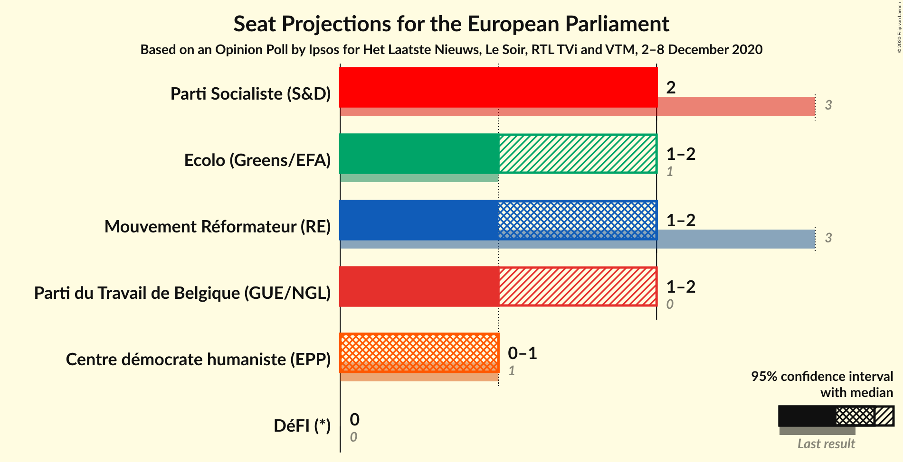
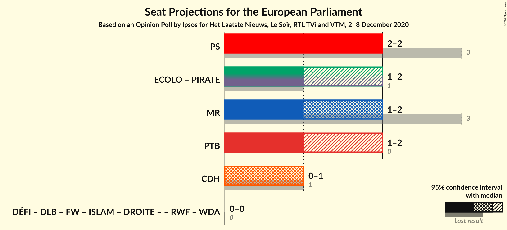

# Opinion Poll by Ipsos for Het Laatste Nieuws, Le Soir, RTL TVi and VTM, 2–8 December 2020

Areas included: Brussels, Wallonia

<a href="#voting-intentions">Voting Intentions</a> | <a href="#seats">Seats</a> | <a href="#coalitions">Coalitions</a> | <a href="#technical-information">Technical Information</a>

## Voting Intentions

### Confidence Intervals

| Party | Last Result | Poll Result | 80% Confidence Interval | 90% Confidence Interval | 95% Confidence Interval | 99% Confidence Interval |
|:-----:|:-----------:|:-----------:|:-----------------------:|:-----------------------:|:-----------------------:|:-----------------------:|
| Parti Socialiste (S&D) | 29.3% | 22.8% | 21.2–24.4% |20.8–24.8% |20.5–25.2% |19.8–26.0% |
| Mouvement Réformateur (RE) | 27.1% | 19.9% | 18.5–21.5% |18.1–21.9% |17.7–22.3% |17.1–23.0% |
| Ecolo (Greens/EFA) | 11.7% | 17.2% | 15.9–18.7% |15.5–19.1% |15.2–19.5% |14.5–20.2% |
| Parti du Travail de Belgique (GUE/NGL) | 5.5% | 17.2% | 15.9–18.7% |15.5–19.1% |15.2–19.5% |14.5–20.2% |
| Centre démocrate humaniste (EPP) | 11.4% | 9.5% | 8.5–10.7% |8.2–11.1% |8.0–11.3% |7.5–11.9% |
| DéFI (RE) | 3.4% | 5.2% | 4.5–6.2% |4.3–6.4% |4.1–6.7% |3.8–7.1% |

*Note:* The poll result column reflects the actual value used in the calculations. Published results may vary slightly, and in addition be rounded to fewer digits.

## Seats

### Confidence Intervals

| Party | Last Result | Median | 80% Confidence Interval | 90% Confidence Interval | 95% Confidence Interval | 99% Confidence Interval |
|:-----:|:-----------:|:------:|:-----------------------:|:-----------------------:|:-----------------------:|:-----------------------:|
| <a href="#parti-socialiste-(s&d)">Parti Socialiste (S&D)</a> | 3 | 2 | 2 |2 |2 |2–3 |
| <a href="#mouvement-réformateur-(re)">Mouvement Réformateur (RE)</a> | 3 | 2 | 2 |2 |1–2 |1–2 |
| <a href="#ecolo-(greens/efa)">Ecolo (Greens/EFA)</a> | 1 | 1 | 1–2 |1–2 |1–2 |1–2 |
| <a href="#parti-du-travail-de-belgique-(gue/ngl)">Parti du Travail de Belgique (GUE/NGL)</a> | 0 | 1 | 1–2 |1–2 |1–2 |1–2 |
| <a href="#centre-démocrate-humaniste-(epp)">Centre démocrate humaniste (EPP)</a> | 1 | 1 | 0–1 |0–1 |0–1 |0–1 |
| <a href="#défi-(re)">DéFI (RE)</a> | 0 | 0 | 0 |0 |0 |0 |

### Parti Socialiste (S&D)

*For a full overview of the results for this party, see the [Parti Socialiste (S&D)](party-partisocialistesd.html) page.*

| Number of Seats | Probability | Accumulated | Special Marks |
|:---------------:|:-----------:|:-----------:|:-------------:|
| 2 | 98% | 100% | Median |
| 3 | 2% | 2% | Last Result |
| 4 | 0% | 0% |  |

### Mouvement Réformateur (RE)

*For a full overview of the results for this party, see the [Mouvement Réformateur (RE)](party-mouvementréformateurre.html) page.*

| Number of Seats | Probability | Accumulated | Special Marks |
|:---------------:|:-----------:|:-----------:|:-------------:|
| 1 | 3% | 100% |  |
| 2 | 97% | 97% | Median |
| 3 | 0% | 0% | Last Result |

### Ecolo (Greens/EFA)

*For a full overview of the results for this party, see the [Ecolo (Greens/EFA)](party-ecologreensefa.html) page.*

| Number of Seats | Probability | Accumulated | Special Marks |
|:---------------:|:-----------:|:-----------:|:-------------:|
| 1 | 54% | 100% | Last Result, Median |
| 2 | 46% | 46% |  |
| 3 | 0% | 0% |  |

### Parti du Travail de Belgique (GUE/NGL)

*For a full overview of the results for this party, see the [Parti du Travail de Belgique (GUE/NGL)](party-partidutravaildebelgiqueguengl.html) page.*

| Number of Seats | Probability | Accumulated | Special Marks |
|:---------------:|:-----------:|:-----------:|:-------------:|
| 0 | 0% | 100% | Last Result |
| 1 | 57% | 100% | Median |
| 2 | 43% | 43% |  |
| 3 | 0% | 0% |  |

### Centre démocrate humaniste (EPP)

*For a full overview of the results for this party, see the [Centre démocrate humaniste (EPP)](party-centredémocratehumanisteepp.html) page.*

| Number of Seats | Probability | Accumulated | Special Marks |
|:---------------:|:-----------:|:-----------:|:-------------:|
| 0 | 15% | 100% |  |
| 1 | 85% | 85% | Last Result, Median |
| 2 | 0% | 0% |  |

### DéFI (RE)

*For a full overview of the results for this party, see the [DéFI (RE)](party-défire.html) page.*

| Number of Seats | Probability | Accumulated | Special Marks |
|:---------------:|:-----------:|:-----------:|:-------------:|
| 0 | 100% | 100% | Last Result, Median |

## Coalitions

### Confidence Intervals

| Coalition | Last Result | Median | Majority? | 80% Confidence Interval | 90% Confidence Interval | 95% Confidence Interval | 99% Confidence Interval |
|:---------:|:-----------:|:------:|:---------:|:-----------------------:|:-----------------------:|:-----------------------:|:-----------------------:|
| Parti Socialiste (S&D) | 3 | 2 | 0% | 2 | 2 | 2 | 2–3 |
| Mouvement Réformateur (RE) – DéFI (RE) | 3 | 2 | 0% | 2 | 2 | 1–2 | 1–2 |
| Parti du Travail de Belgique (GUE/NGL) | 0 | 1 | 0% | 1–2 | 1–2 | 1–2 | 1–2 |
| Centre démocrate humaniste (EPP) | 1 | 1 | 0% | 0–1 | 0–1 | 0–1 | 0–1 |

### Parti Socialiste (S&D)

| Number of Seats | Probability | Accumulated | Special Marks |
|:---------------:|:-----------:|:-----------:|:-------------:|
| 2 | 98% | 100% | Median |
| 3 | 2% | 2% | Last Result |
| 4 | 0% | 0% |  |

### Mouvement Réformateur (RE) – DéFI (RE)

| Number of Seats | Probability | Accumulated | Special Marks |
|:---------------:|:-----------:|:-----------:|:-------------:|
| 1 | 3% | 100% |  |
| 2 | 97% | 97% | Median |
| 3 | 0% | 0% | Last Result |

### Parti du Travail de Belgique (GUE/NGL)

| Number of Seats | Probability | Accumulated | Special Marks |
|:---------------:|:-----------:|:-----------:|:-------------:|
| 0 | 0% | 100% | Last Result |
| 1 | 57% | 100% | Median |
| 2 | 43% | 43% |  |
| 3 | 0% | 0% |  |

### Centre démocrate humaniste (EPP)

| Number of Seats | Probability | Accumulated | Special Marks |
|:---------------:|:-----------:|:-----------:|:-------------:|
| 0 | 15% | 100% |  |
| 1 | 85% | 85% | Last Result, Median |
| 2 | 0% | 0% |  |

## Technical Information

### Opinion Poll

+ **Polling firm:** Ipsos
+ **Commissioner(s):** Het Laatste Nieuws, Le Soir, RTL TVi and VTM
+ **Fieldwork period:** 2–8 December 2020

### Calculations

+ **Sample size:** 1186
+ **Simulations done:** 1,048,576
+ **Error estimate:** 0.61%

