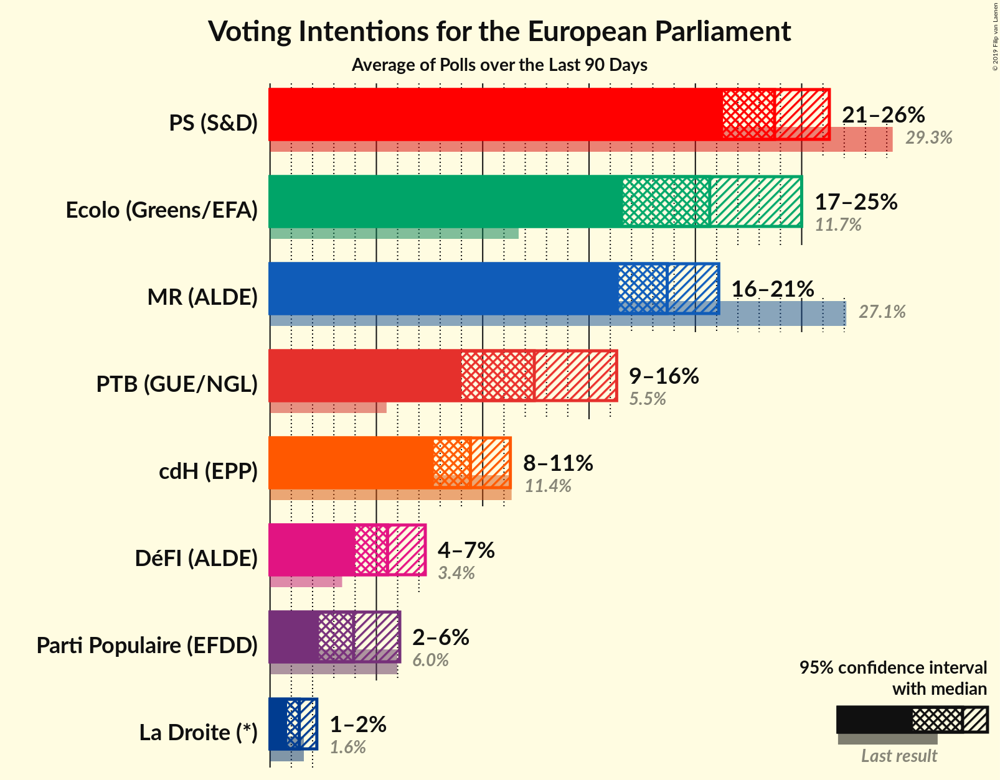
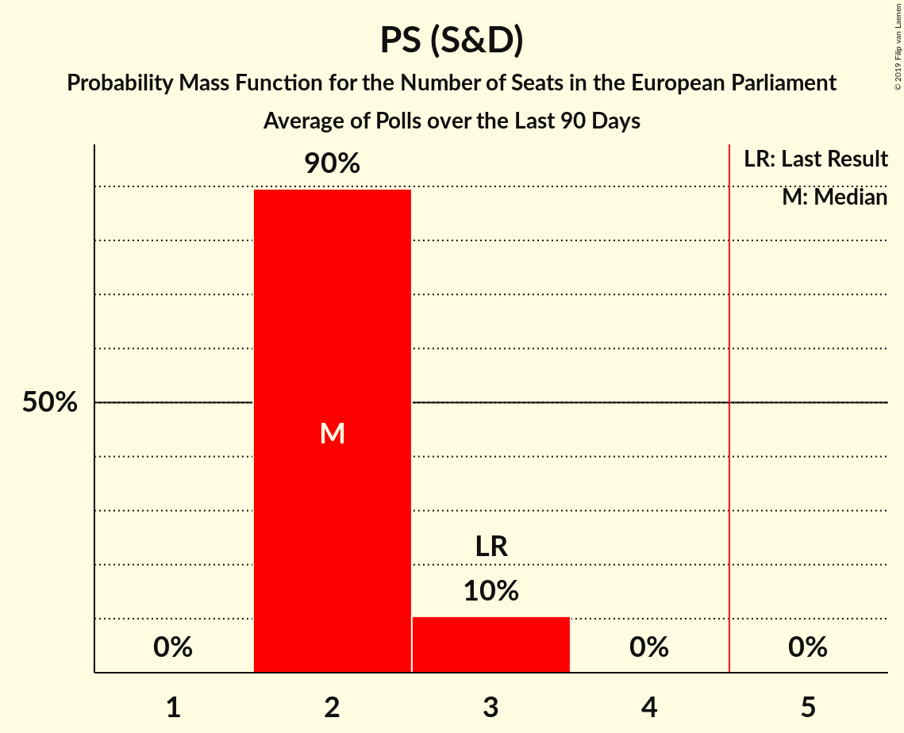
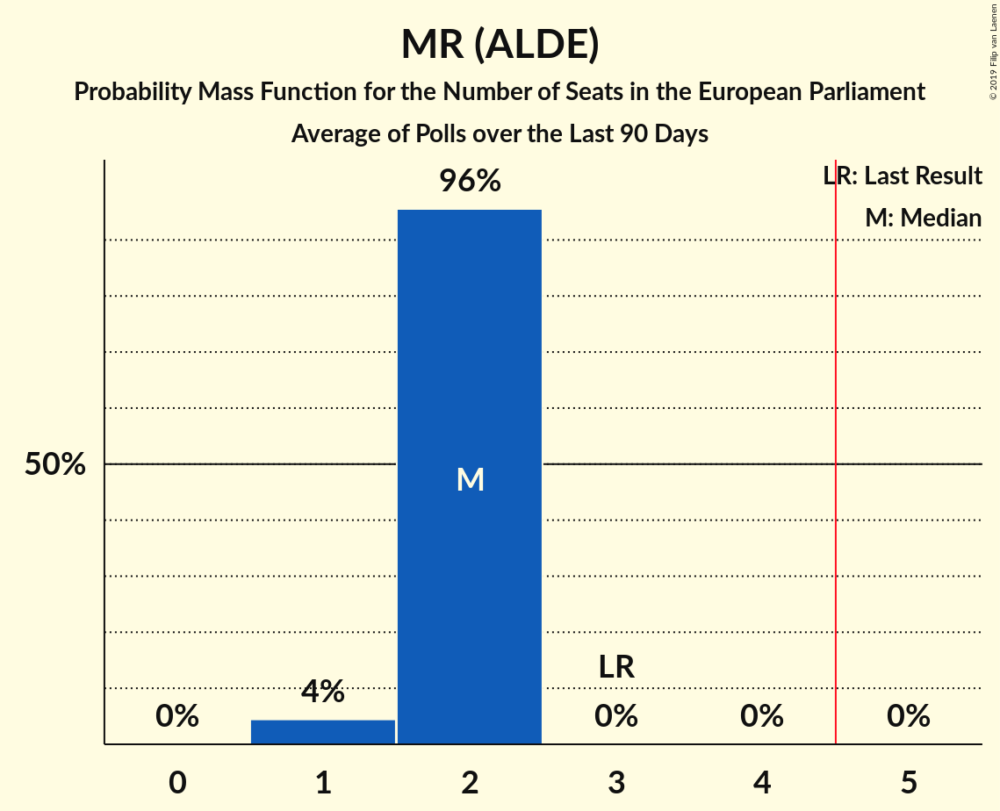
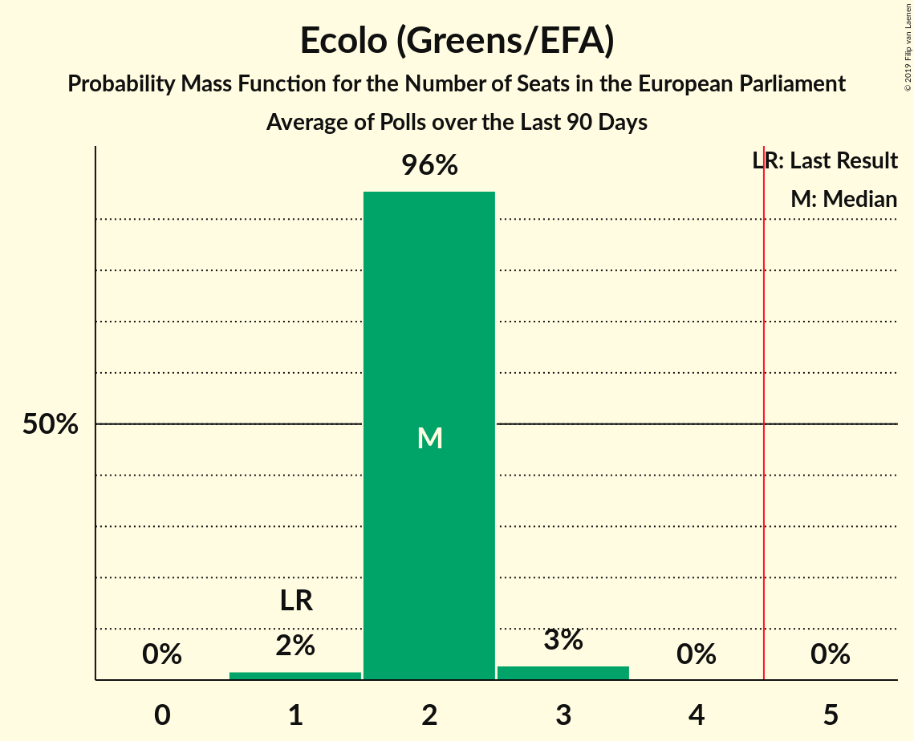
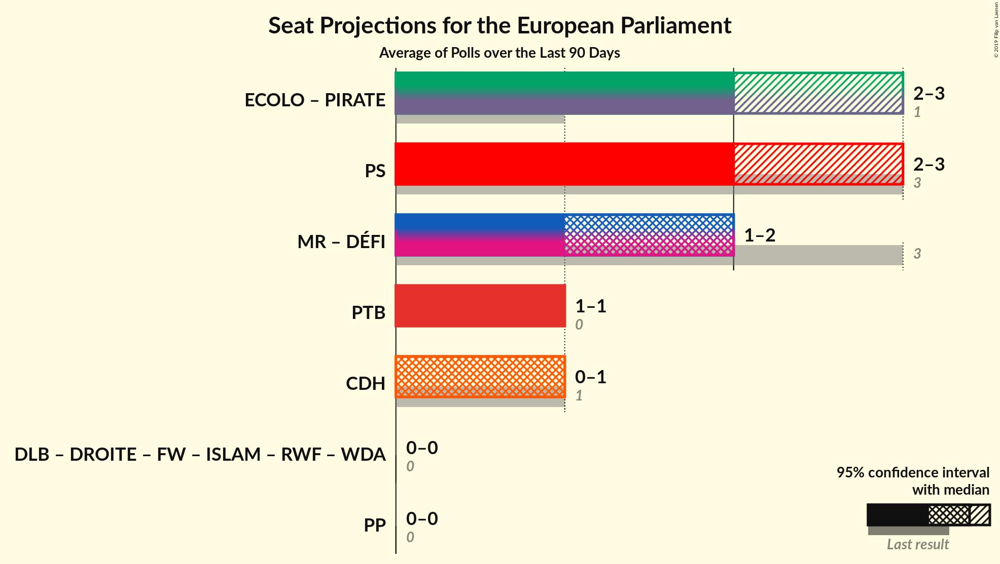
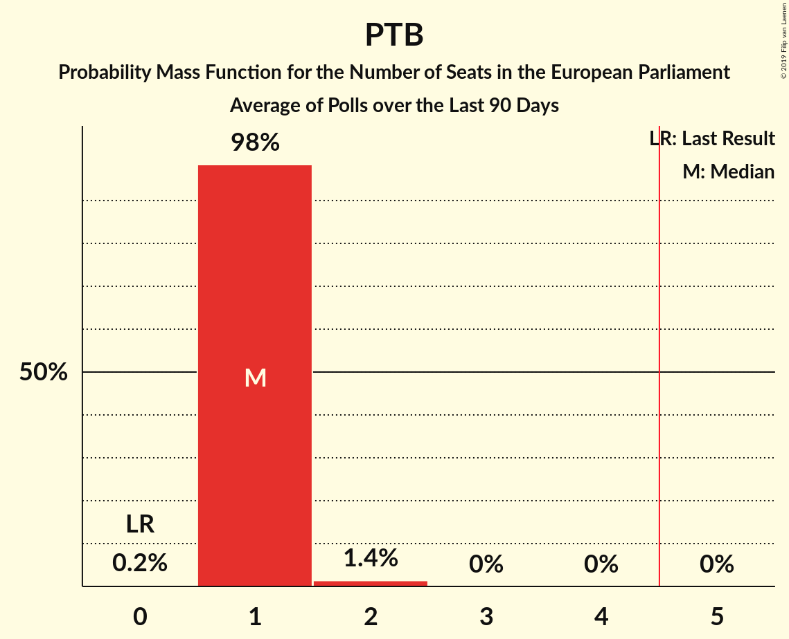
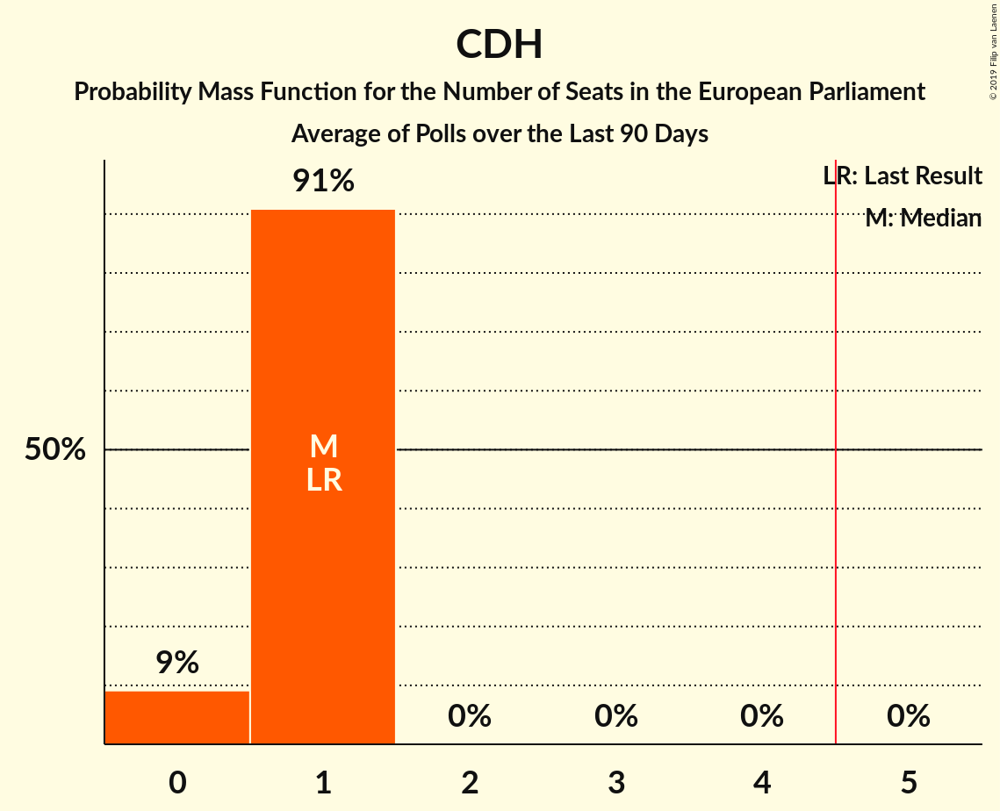

# Poll Average

<a href="#voting-intentions">Voting Intentions</a> | <a href="#seats">Seats</a> | <a href="#coalitions">Coalitions</a> | <a href="#technical-information">Technical Information</a>

## Summary

The table below lists the polls on which the average is based. They are the most recent polls (less than 90 days old) registered and analyzed so far.

| Period     | Polling firm/Commissioner(s) | PS | MR | ECOLO | CDH | PP | PTB | DÉFI | DLB | DROITE | RWF | WDA | PIRATE | FW | ISLAM |
|:----------:|:----------------------------:|:--:|:--:|:--:|:--:|:--:|:--:|:--:|:--:|:--:|:--:|:--:|:--:|:--:|:--:|
| 25 May 2014 | General Election | 29.3%   3 | 27.1%   3 | 11.7%   1 | 11.4%   1 | 6.0%   0 | 5.5%   0 | 3.4%   0 | 3.0%   0 | 1.6%   0 | 0.0%   0 | 0.0%   0 | 0.0%   0 | 0.0%   0 | 0.0%   0 |
| N/A | Poll Average | 21–26%   2–3 | 17–22%   2 | 16–21%   1–2 | 8–12%   1 | 4–6%   0 | 9–12%   1 | 5–8%   0 | N/A   N/A | 1–2%   0 | N/A   N/A | N/A   N/A | N/A   N/A | N/A   N/A | N/A   N/A |
| [25 March–14 April 2019](2019-04-14-TNS.html) | TNS   De Standaard, La Libre Belgique, RTBf and VRT | N/A   N/A | N/A   N/A | N/A   N/A | N/A   N/A | N/A   N/A | N/A   N/A | N/A   N/A | N/A   N/A | N/A   N/A | N/A   N/A | N/A   N/A | N/A   N/A | N/A   N/A | N/A   N/A |
| [5–11 February 2019](2019-02-11-Ipsos.html) | Ipsos   Het Laatste Nieuws, Le Soir, RTL TVi and VTM | 21–26%   2–3 | 17–21%   2 | 16–21%   1–2 | 8–12%   1 | 4–6%   0 | 9–12%   1 | 5–8%   0 | N/A   N/A | 1–2%   0 | N/A   N/A | N/A   N/A | N/A   N/A | N/A   N/A | N/A   N/A |
| 25 May 2014 | General Election | 29.3%   3 | 27.1%   3 | 11.7%   1 | 11.4%   1 | 6.0%   0 | 5.5%   0 | 3.4%   0 | 3.0%   0 | 1.6%   0 | 0.0%   0 | 0.0%   0 | 0.0%   0 | 0.0%   0 | 0.0%   0 |

Only polls for which at least the sample size has been published are included in the table above.

**Legend:**
+ **Top half of each row:** Voting intentions (95% confidence interval)
+ **Bottom half of each row:** Seat projections for the European Parliament (95% confidence interval)
+ **PS:** PS (S&D)
+ **MR:** MR (ALDE)
+ **ECOLO:** Ecolo (Greens/EFA)
+ **CDH:** cdH (EPP)
+ **PP:** Parti Populaire (EFDD)
+ **PTB:** PTB (GUE/NGL)
+ **DÉFI:** DéFI (ALDE)
+ **DLB:** Debout les Belges (*)
+ **DROITE:** La Droite (*)
+ **RWF:** R.W.F. (*)
+ **WDA:** Wallonie d’Abord (*)
+ **PIRATE:** PIRATE (Greens/EFA)
+ **FW:** FW (*)
+ **ISLAM:** ISLAM (*)
+ **N/A (single party):** Party not included the published results
+ **N/A (entire row):** Calculation for this opinion poll not started yet

## Voting Intentions

### Confidence Intervals

| Party | Last Result | Median | 80% Confidence Interval | 90% Confidence Interval | 95% Confidence Interval | 99% Confidence Interval |
|:-----:|:-----------:|:------:|:-----------------------:|:-----------------------:|:-----------------------:|:-----------------------:|
| <a href="#ps-(s&d)">PS (S&D)</a> | 29.3% | 23.3% | 21.8–24.9% |21.4–25.4% | 21.0–25.8% | 20.3–26.6% |
| <a href="#mr-(alde)">MR (ALDE)</a> | 27.1% | 19.2% | 17.7–20.6% |17.4–21.1% | 17.0–21.5% | 16.4–22.2% |
| <a href="#ecolo-(greens/efa)">Ecolo (Greens/EFA)</a> | 11.7% | 18.4% | 17.0–19.9% |16.6–20.3% | 16.3–20.7% | 15.7–21.4% |
| <a href="#cdh-(epp)">cdH (EPP)</a> | 11.4% | 9.8% | 8.7–10.9% |8.4–11.2% | 8.2–11.5% | 7.7–12.1% |
| <a href="#parti-populaire-(efdd)">Parti Populaire (EFDD)</a> | 6.0% | 5.0% | 4.2–5.8% |4.0–6.1% | 3.8–6.3% | 3.5–6.7% |
| <a href="#ptb-(gue/ngl)">PTB (GUE/NGL)</a> | 5.5% | 10.4% | 9.3–11.5% |9.0–11.9% | 8.7–12.2% | 8.2–12.8% |
| <a href="#défi-(alde)">DéFI (ALDE)</a> | 3.4% | 6.1% | 5.3–7.0% |5.1–7.3% | 4.9–7.6% | 4.5–8.1% |
| <a href="#debout-les-belges-(*)">Debout les Belges (*)</a> | 3.0% | N/A | N/A |N/A | N/A | N/A |
| <a href="#la-droite-(*)">La Droite (*)</a> | 1.6% | 1.4% | 1.0–1.9% |0.9–2.0% | 0.8–2.2% | 0.7–2.4% |
| <a href="#r.w.f.-(*)">R.W.F. (*)</a> | 0.0% | N/A | N/A |N/A | N/A | N/A |
| <a href="#wallonie-d’abord-(*)">Wallonie d’Abord (*)</a> | 0.0% | N/A | N/A |N/A | N/A | N/A |
| <a href="#pirate-(greens/efa)">PIRATE (Greens/EFA)</a> | 0.0% | N/A | N/A |N/A | N/A | N/A |
| <a href="#fw-(*)">FW (*)</a> | 0.0% | N/A | N/A |N/A | N/A | N/A |
| <a href="#islam-(*)">ISLAM (*)</a> | 0.0% | N/A | N/A |N/A | N/A | N/A |

### PS (S&D)

*For a full overview of the results for this party, see the [PS (S&D)](party-pssd.html) page.*

| Voting Intentions | Probability | Accumulated | Special Marks |
|:-----------------:|:-----------:|:-----------:|:-------------:|
| 18.5–19.5% | 0.1% | 100% |  |
| 19.5–20.5% | 0.9% | 99.9% |  |
| 20.5–21.5% | 6% | 99.1% |  |
| 21.5–22.5% | 19% | 93% |  |
| 22.5–23.5% | 31% | 74% | Median |
| 23.5–24.5% | 27% | 43% |  |
| 24.5–25.5% | 12% | 16% |  |
| 25.5–26.5% | 3% | 4% |  |
| 26.5–27.5% | 0.5% | 0.5% |  |
| 27.5–28.5% | 0% | 0% |  |
| 28.5–29.5% | 0% | 0% | Last Result |

### MR (ALDE)

*For a full overview of the results for this party, see the [MR (ALDE)](party-mralde.html) page.*

| Voting Intentions | Probability | Accumulated | Special Marks |
|:-----------------:|:-----------:|:-----------:|:-------------:|
| 14.5–15.5% | 0% | 100% |  |
| 15.5–16.5% | 0.8% | 100% |  |
| 16.5–17.5% | 6% | 99.2% |  |
| 17.5–18.5% | 22% | 93% |  |
| 18.5–19.5% | 34% | 71% | Median |
| 19.5–20.5% | 25% | 37% |  |
| 20.5–21.5% | 10% | 12% |  |
| 21.5–22.5% | 2% | 2% |  |
| 22.5–23.5% | 0.2% | 0.2% |  |
| 23.5–24.5% | 0% | 0% |  |
| 24.5–25.5% | 0% | 0% |  |
| 25.5–26.5% | 0% | 0% |  |
| 26.5–27.5% | 0% | 0% | Last Result |

### Ecolo (Greens/EFA)

*For a full overview of the results for this party, see the [Ecolo (Greens/EFA)](party-ecologreensefa.html) page.*

| Voting Intentions | Probability | Accumulated | Special Marks |
|:-----------------:|:-----------:|:-----------:|:-------------:|
| 11.5–12.5% | 0% | 100% | Last Result |
| 12.5–13.5% | 0% | 100% |  |
| 13.5–14.5% | 0% | 100% |  |
| 14.5–15.5% | 0.3% | 100% |  |
| 15.5–16.5% | 4% | 99.6% |  |
| 16.5–17.5% | 17% | 96% |  |
| 17.5–18.5% | 33% | 79% | Median |
| 18.5–19.5% | 30% | 45% |  |
| 19.5–20.5% | 13% | 16% |  |
| 20.5–21.5% | 3% | 3% |  |
| 21.5–22.5% | 0.3% | 0.4% |  |
| 22.5–23.5% | 0% | 0% |  |

### cdH (EPP)

*For a full overview of the results for this party, see the [cdH (EPP)](party-cdhepp.html) page.*

| Voting Intentions | Probability | Accumulated | Special Marks |
|:-----------------:|:-----------:|:-----------:|:-------------:|
| 5.5–6.5% | 0% | 100% |  |
| 6.5–7.5% | 0.2% | 100% |  |
| 7.5–8.5% | 7% | 99.8% |  |
| 8.5–9.5% | 33% | 93% |  |
| 9.5–10.5% | 41% | 60% | Median |
| 10.5–11.5% | 17% | 19% | Last Result |
| 11.5–12.5% | 2% | 2% |  |
| 12.5–13.5% | 0.1% | 0.1% |  |
| 13.5–14.5% | 0% | 0% |  |

### Parti Populaire (EFDD)

*For a full overview of the results for this party, see the [Parti Populaire (EFDD)](party-partipopulaireefdd.html) page.*

| Voting Intentions | Probability | Accumulated | Special Marks |
|:-----------------:|:-----------:|:-----------:|:-------------:|
| 1.5–2.5% | 0% | 100% |  |
| 2.5–3.5% | 0.6% | 100% |  |
| 3.5–4.5% | 25% | 99.4% |  |
| 4.5–5.5% | 56% | 75% | Median |
| 5.5–6.5% | 17% | 18% | Last Result |
| 6.5–7.5% | 1.0% | 1.0% |  |
| 7.5–8.5% | 0% | 0% |  |

### PTB (GUE/NGL)

*For a full overview of the results for this party, see the [PTB (GUE/NGL)](party-ptbguengl.html) page.*

| Voting Intentions | Probability | Accumulated | Special Marks |
|:-----------------:|:-----------:|:-----------:|:-------------:|
| 4.5–5.5% | 0% | 100% | Last Result |
| 5.5–6.5% | 0% | 100% |  |
| 6.5–7.5% | 0% | 100% |  |
| 7.5–8.5% | 1.4% | 100% |  |
| 8.5–9.5% | 16% | 98.5% |  |
| 9.5–10.5% | 41% | 83% | Median |
| 10.5–11.5% | 32% | 42% |  |
| 11.5–12.5% | 8% | 9% |  |
| 12.5–13.5% | 0.9% | 0.9% |  |
| 13.5–14.5% | 0% | 0% |  |

### DéFI (ALDE)

*For a full overview of the results for this party, see the [DéFI (ALDE)](party-défialde.html) page.*

| Voting Intentions | Probability | Accumulated | Special Marks |
|:-----------------:|:-----------:|:-----------:|:-------------:|
| 2.5–3.5% | 0% | 100% | Last Result |
| 3.5–4.5% | 0.7% | 100% |  |
| 4.5–5.5% | 19% | 99.3% |  |
| 5.5–6.5% | 53% | 80% | Median |
| 6.5–7.5% | 24% | 27% |  |
| 7.5–8.5% | 3% | 3% |  |
| 8.5–9.5% | 0.1% | 0.1% |  |
| 9.5–10.5% | 0% | 0% |  |

### La Droite (*)

*For a full overview of the results for this party, see the [La Droite (*)](party-ladroite.html) page.*

| Voting Intentions | Probability | Accumulated | Special Marks |
|:-----------------:|:-----------:|:-----------:|:-------------:|
| 0.0–0.5% | 0% | 100% |  |
| 0.5–1.5% | 69% | 100% | Median |
| 1.5–2.5% | 31% | 31% | Last Result |
| 2.5–3.5% | 0.3% | 0.3% |  |
| 3.5–4.5% | 0% | 0% |  |

## Seats

### Confidence Intervals

| Party | Last Result | Median | 80% Confidence Interval | 90% Confidence Interval | 95% Confidence Interval | 99% Confidence Interval |
|:-----:|:-----------:|:------:|:-----------------------:|:-----------------------:|:-----------------------:|:-----------------------:|
| <a href="#ps-(s&d)">PS (S&D)</a> | 3 | 2 | 2 |2–3 | 2–3 | 2–3 |
| <a href="#mr-(alde)">MR (ALDE)</a> | 3 | 2 | 2 |2 | 2 | 1–2 |
| <a href="#ecolo-(greens/efa)">Ecolo (Greens/EFA)</a> | 1 | 2 | 2 |2 | 1–2 | 1–2 |
| <a href="#cdh-(epp)">cdH (EPP)</a> | 1 | 1 | 1 |1 | 1 | 0–1 |
| <a href="#parti-populaire-(efdd)">Parti Populaire (EFDD)</a> | 0 | 0 | 0 |0 | 0 | 0 |
| <a href="#ptb-(gue/ngl)">PTB (GUE/NGL)</a> | 0 | 1 | 1 |1 | 1 | 1 |
| <a href="#défi-(alde)">DéFI (ALDE)</a> | 0 | 0 | 0 |0 | 0 | 0 |
| <a href="#debout-les-belges-(*)">Debout les Belges (*)</a> | 0 | N/A | N/A |N/A | N/A | N/A |
| <a href="#la-droite-(*)">La Droite (*)</a> | 0 | 0 | 0 |0 | 0 | 0 |
| <a href="#r.w.f.-(*)">R.W.F. (*)</a> | 0 | N/A | N/A |N/A | N/A | N/A |
| <a href="#wallonie-d’abord-(*)">Wallonie d’Abord (*)</a> | 0 | N/A | N/A |N/A | N/A | N/A |
| <a href="#pirate-(greens/efa)">PIRATE (Greens/EFA)</a> | 0 | N/A | N/A |N/A | N/A | N/A |
| <a href="#fw-(*)">FW (*)</a> | 0 | N/A | N/A |N/A | N/A | N/A |
| <a href="#islam-(*)">ISLAM (*)</a> | 0 | N/A | N/A |N/A | N/A | N/A |

### PS (S&D)

*For a full overview of the results for this party, see the [PS (S&D)](party-pssd.html) page.*

| Number of Seats | Probability | Accumulated | Special Marks |
|:---------------:|:-----------:|:-----------:|:-------------:|
| 2 | 95% | 100% | Median |
| 3 | 5% | 5% | Last Result |
| 4 | 0% | 0% |  |

### MR (ALDE)

*For a full overview of the results for this party, see the [MR (ALDE)](party-mralde.html) page.*

| Number of Seats | Probability | Accumulated | Special Marks |
|:---------------:|:-----------:|:-----------:|:-------------:|
| 1 | 1.0% | 100% |  |
| 2 | 99.0% | 99.0% | Median |
| 3 | 0% | 0% | Last Result |

### Ecolo (Greens/EFA)

*For a full overview of the results for this party, see the [Ecolo (Greens/EFA)](party-ecologreensefa.html) page.*

| Number of Seats | Probability | Accumulated | Special Marks |
|:---------------:|:-----------:|:-----------:|:-------------:|
| 1 | 3% | 100% | Last Result |
| 2 | 97% | 97% | Median |
| 3 | 0% | 0% |  |

### cdH (EPP)

*For a full overview of the results for this party, see the [cdH (EPP)](party-cdhepp.html) page.*

| Number of Seats | Probability | Accumulated | Special Marks |
|:---------------:|:-----------:|:-----------:|:-------------:|
| 0 | 2% | 100% |  |
| 1 | 98% | 98% | Last Result, Median |
| 2 | 0% | 0% |  |

### Parti Populaire (EFDD)

*For a full overview of the results for this party, see the [Parti Populaire (EFDD)](party-partipopulaireefdd.html) page.*

| Number of Seats | Probability | Accumulated | Special Marks |
|:---------------:|:-----------:|:-----------:|:-------------:|
| 0 | 100% | 100% | Last Result, Median |

### PTB (GUE/NGL)

*For a full overview of the results for this party, see the [PTB (GUE/NGL)](party-ptbguengl.html) page.*

| Number of Seats | Probability | Accumulated | Special Marks |
|:---------------:|:-----------:|:-----------:|:-------------:|
| 0 | 0.5% | 100% | Last Result |
| 1 | 99.5% | 99.5% | Median |
| 2 | 0% | 0% |  |

### DéFI (ALDE)

*For a full overview of the results for this party, see the [DéFI (ALDE)](party-défialde.html) page.*

| Number of Seats | Probability | Accumulated | Special Marks |
|:---------------:|:-----------:|:-----------:|:-------------:|
| 0 | 99.9% | 100% | Last Result, Median |
| 1 | 0.1% | 0.1% |  |
| 2 | 0% | 0% |  |

### La Droite (*)

*For a full overview of the results for this party, see the [La Droite (*)](party-ladroite.html) page.*

| Number of Seats | Probability | Accumulated | Special Marks |
|:---------------:|:-----------:|:-----------:|:-------------:|
| 0 | 100% | 100% | Last Result, Median |

## Coalitions

### Confidence Intervals

| Coalition | Last Result | Median | Majority? | 80% Confidence Interval | 90% Confidence Interval | 95% Confidence Interval | 99% Confidence Interval |
|:---------:|:-----------:|:------:|:---------:|:-----------------------:|:-----------------------:|:-----------------------:|:-----------------------:|
| PS (S&D) | 3 | 2 | 0% | 2 | 2–3 | 2–3 | 2–3 |
| MR (ALDE) – DéFI (ALDE) | 3 | 2 | 0% | 2 | 2 | 2 | 1–2 |
| Ecolo (Greens/EFA) – PIRATE (Greens/EFA) | 1 | 2 | 0% | 2 | 2 | 1–2 | 1–2 |
| PTB (GUE/NGL) | 0 | 1 | 0% | 1 | 1 | 1 | 1 |
| cdH (EPP) | 1 | 1 | 0% | 1 | 1 | 1 | 0–1 |
| Debout les Belges (*) – La Droite (*) – FW (*) – ISLAM (*) – R.W.F. (*) – Wallonie d’Abord (*) | 0 | 0 | 0% | 0 | 0 | 0 | 0 |
| Parti Populaire (EFDD) | 0 | 0 | 0% | 0 | 0 | 0 | 0 |

### PS (S&D)

| Number of Seats | Probability | Accumulated | Special Marks |
|:---------------:|:-----------:|:-----------:|:-------------:|
| 2 | 95% | 100% | Median |
| 3 | 5% | 5% | Last Result |
| 4 | 0% | 0% |  |

### MR (ALDE) – DéFI (ALDE)

| Number of Seats | Probability | Accumulated | Special Marks |
|:---------------:|:-----------:|:-----------:|:-------------:|
| 1 | 1.0% | 100% |  |
| 2 | 98.9% | 99.0% | Median |
| 3 | 0.1% | 0.1% | Last Result |
| 4 | 0% | 0% |  |

### Ecolo (Greens/EFA) – PIRATE (Greens/EFA)

| Number of Seats | Probability | Accumulated | Special Marks |
|:---------------:|:-----------:|:-----------:|:-------------:|
| 1 | 3% | 100% | Last Result |
| 2 | 97% | 97% | Median |
| 3 | 0% | 0% |  |

### PTB (GUE/NGL)

| Number of Seats | Probability | Accumulated | Special Marks |
|:---------------:|:-----------:|:-----------:|:-------------:|
| 0 | 0.5% | 100% | Last Result |
| 1 | 99.5% | 99.5% | Median |
| 2 | 0% | 0% |  |

### cdH (EPP)

| Number of Seats | Probability | Accumulated | Special Marks |
|:---------------:|:-----------:|:-----------:|:-------------:|
| 0 | 2% | 100% |  |
| 1 | 98% | 98% | Last Result, Median |
| 2 | 0% | 0% |  |

### Debout les Belges (*) – La Droite (*) – FW (*) – ISLAM (*) – R.W.F. (*) – Wallonie d’Abord (*)

| Number of Seats | Probability | Accumulated | Special Marks |
|:---------------:|:-----------:|:-----------:|:-------------:|
| 0 | 100% | 100% | Last Result, Median |

### Parti Populaire (EFDD)

| Number of Seats | Probability | Accumulated | Special Marks |
|:---------------:|:-----------:|:-----------:|:-------------:|
| 0 | 100% | 100% | Last Result, Median |

## Technical Information

+ **Number of polls included in this average:** 2
+ **Lowest number of simulations done in a poll included in this average:** 0
+ **Total number of simulations done in the polls included in this average:** 1,048,576
+ **Error estimate:** 2.03%
