# Poll Average

<a href="#voting-intentions">Voting Intentions</a> | <a href="#seats">Seats</a> | <a href="#coalitions">Coalitions</a> | <a href="#technical-information">Technical Information</a>

## Summary

The table below lists the polls on which the average is based. They are the most recent polls (less than 30 days old) registered and analyzed so far.

| Period     | Polling firm/Commissioner(s) | PS | MR | ECOLO | LE | PP | PTB | DÉFI | DLB | DROITE | RWF | WDA | PIRATE | FW | ISLAM |
|:----------:|:----------------------------:|:--:|:--:|:--:|:--:|:--:|:--:|:--:|:--:|:--:|:--:|:--:|:--:|:--:|:--:|
| 26 May 2019 | General Election | 29.3%   3 | 27.1%   3 | 11.7%   1 | 11.4%   1 | 6.0%   0 | 5.5%   0 | 3.4%   0 | 3.0%   0 | 1.6%   0 | 0.0%   0 | 0.0%   0 | 0.0%   0 | 0.0%   0 | 0.0%   0 |
| N/A | Poll Average | 22–29%   2–3 | 17–23%   1–2 | 11–16%   1 | 6–11%   0–1 | N/A   N/A | 17–23%   1–2 | 4–8%   0 | N/A   N/A | N/A   N/A | N/A   N/A | N/A   N/A | N/A   N/A | N/A   N/A | N/A   N/A |
| [16–29 January 2023](2023-01-29-Kantar.html) | Kantar   La Libre Belgique and RTBf | 22–29%   2–3 | 17–23%   1–2 | 11–17%   1 | 6–11%   0–1 | N/A   N/A | 17–23%   1–2 | 5–8%   0 | N/A   N/A | N/A   N/A | N/A   N/A | N/A   N/A | N/A   N/A | N/A   N/A | N/A   N/A |
| 26 May 2019 | General Election | 29.3%   3 | 27.1%   3 | 11.7%   1 | 11.4%   1 | 6.0%   0 | 5.5%   0 | 3.4%   0 | 3.0%   0 | 1.6%   0 | 0.0%   0 | 0.0%   0 | 0.0%   0 | 0.0%   0 | 0.0%   0 |

Only polls for which at least the sample size has been published are included in the table above.

**Legend:**
+ **Top half of each row:** Voting intentions (95% confidence interval)
+ **Bottom half of each row:** Seat projections for the European Parliament (95% confidence interval)
+ **PS:** Parti Socialiste (S&D)
+ **MR:** Mouvement Réformateur (RE)
+ **ECOLO:** Ecolo (Greens/EFA)
+ **LE:** Les Engagés (EPP)
+ **PP:** Parti Populaire (NI)
+ **PTB:** Parti du Travail de Belgique (GUE/NGL)
+ **DÉFI:** DéFI (*)
+ **DLB:** Debout les Belges (*)
+ **DROITE:** La Droite (*)
+ **RWF:** R.W.F. (*)
+ **WDA:** Wallonie d’Abord (*)
+ **PIRATE:** PIRATE (Greens/EFA)
+ **FW:** FW (*)
+ **ISLAM:** ISLAM (*)
+ **N/A (single party):** Party not included the published results
+ **N/A (entire row):** Calculation for this opinion poll not started yet

## Voting Intentions

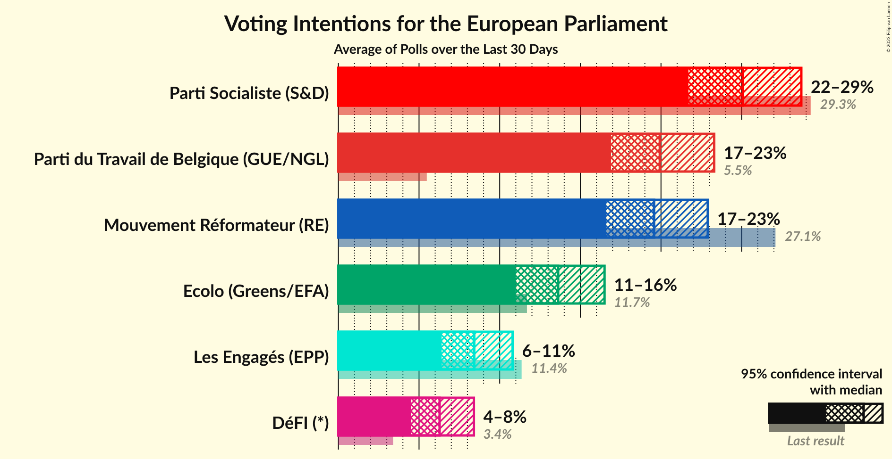

### Confidence Intervals

| Party | Last Result | Median | 80% Confidence Interval | 90% Confidence Interval | 95% Confidence Interval | 99% Confidence Interval |
|:-----:|:-----------:|:------:|:-----------------------:|:-----------------------:|:-----------------------:|:-----------------------:|
| <a href="#parti-socialiste-(s&d)">Parti Socialiste (S&D)</a> | 29.3% | 25.1% | 22.9–27.4% |22.3–28.1% | 21.7–28.7% | 20.7–29.8% |
| <a href="#mouvement-réformateur-(re)">Mouvement Réformateur (RE)</a> | 27.1% | 19.6% | 17.6–21.7% |17.0–22.4% | 16.6–22.9% | 15.7–24.0% |
| <a href="#ecolo-(greens/efa)">Ecolo (Greens/EFA)</a> | 11.7% | 13.6% | 11.9–15.5% |11.4–16.0% | 11.0–16.5% | 10.3–17.5% |
| <a href="#les-engagés-(epp)">Les Engagés (EPP)</a> | 11.4% | 8.4% | 7.1–10.0% |6.7–10.4% | 6.4–10.8% | 5.8–11.7% |
| <a href="#parti-populaire-(ni)">Parti Populaire (NI)</a> | 6.0% | N/A | N/A |N/A | N/A | N/A |
| <a href="#parti-du-travail-de-belgique-(gue/ngl)">Parti du Travail de Belgique (GUE/NGL)</a> | 5.5% | 19.9% | 17.9–22.1% |17.3–22.7% | 16.9–23.3% | 16.0–24.3% |
| <a href="#défi-(*)">DéFI (*)</a> | 3.4% | 6.3% | 5.1–7.6% |4.8–8.0% | 4.5–8.4% | 4.0–9.2% |
| <a href="#debout-les-belges-(*)">Debout les Belges (*)</a> | 3.0% | N/A | N/A |N/A | N/A | N/A |
| <a href="#la-droite-(*)">La Droite (*)</a> | 1.6% | N/A | N/A |N/A | N/A | N/A |
| <a href="#r.w.f.-(*)">R.W.F. (*)</a> | 0.0% | N/A | N/A |N/A | N/A | N/A |
| <a href="#wallonie-d’abord-(*)">Wallonie d’Abord (*)</a> | 0.0% | N/A | N/A |N/A | N/A | N/A |
| <a href="#pirate-(greens/efa)">PIRATE (Greens/EFA)</a> | 0.0% | N/A | N/A |N/A | N/A | N/A |
| <a href="#fw-(*)">FW (*)</a> | 0.0% | N/A | N/A |N/A | N/A | N/A |
| <a href="#islam-(*)">ISLAM (*)</a> | 0.0% | N/A | N/A |N/A | N/A | N/A |

### Parti Socialiste (S&D)

*For a full overview of the results for this party, see the [Parti Socialiste (S&D)](party-partisocialistesd.html) page.*

| Voting Intentions | Probability | Accumulated | Special Marks |
|:-----------------:|:-----------:|:-----------:|:-------------:|
| 18.5–19.5% | 0% | 100% |  |
| 19.5–20.5% | 0.3% | 100% |  |
| 20.5–21.5% | 2% | 99.6% |  |
| 21.5–22.5% | 5% | 98% |  |
| 22.5–23.5% | 12% | 93% |  |
| 23.5–24.5% | 19% | 81% |  |
| 24.5–25.5% | 22% | 62% | Median |
| 25.5–26.5% | 19% | 40% |  |
| 26.5–27.5% | 12% | 21% |  |
| 27.5–28.5% | 6% | 9% |  |
| 28.5–29.5% | 2% | 3% | Last Result |
| 29.5–30.5% | 0.6% | 0.8% |  |
| 30.5–31.5% | 0.1% | 0.2% |  |
| 31.5–32.5% | 0% | 0% |  |

### Mouvement Réformateur (RE)

*For a full overview of the results for this party, see the [Mouvement Réformateur (RE)](party-mouvementréformateurre.html) page.*

| Voting Intentions | Probability | Accumulated | Special Marks |
|:-----------------:|:-----------:|:-----------:|:-------------:|
| 13.5–14.5% | 0% | 100% |  |
| 14.5–15.5% | 0.4% | 100% |  |
| 15.5–16.5% | 2% | 99.6% |  |
| 16.5–17.5% | 7% | 98% |  |
| 17.5–18.5% | 16% | 90% |  |
| 18.5–19.5% | 23% | 74% |  |
| 19.5–20.5% | 23% | 51% | Median |
| 20.5–21.5% | 16% | 28% |  |
| 21.5–22.5% | 8% | 12% |  |
| 22.5–23.5% | 3% | 4% |  |
| 23.5–24.5% | 0.8% | 1.0% |  |
| 24.5–25.5% | 0.2% | 0.2% |  |
| 25.5–26.5% | 0% | 0% |  |
| 26.5–27.5% | 0% | 0% | Last Result |

### Ecolo (Greens/EFA)

*For a full overview of the results for this party, see the [Ecolo (Greens/EFA)](party-ecologreensefa.html) page.*

| Voting Intentions | Probability | Accumulated | Special Marks |
|:-----------------:|:-----------:|:-----------:|:-------------:|
| 7.5–8.5% | 0% | 100% |  |
| 8.5–9.5% | 0.1% | 100% |  |
| 9.5–10.5% | 0.9% | 99.9% |  |
| 10.5–11.5% | 5% | 99.1% |  |
| 11.5–12.5% | 16% | 94% | Last Result |
| 12.5–13.5% | 27% | 78% |  |
| 13.5–14.5% | 26% | 52% | Median |
| 14.5–15.5% | 16% | 25% |  |
| 15.5–16.5% | 7% | 9% |  |
| 16.5–17.5% | 2% | 2% |  |
| 17.5–18.5% | 0.4% | 0.4% |  |
| 18.5–19.5% | 0.1% | 0.1% |  |
| 19.5–20.5% | 0% | 0% |  |

### Les Engagés (EPP)

*For a full overview of the results for this party, see the [Les Engagés (EPP)](party-lesengagésepp.html) page.*

| Voting Intentions | Probability | Accumulated | Special Marks |
|:-----------------:|:-----------:|:-----------:|:-------------:|
| 3.5–4.5% | 0% | 100% |  |
| 4.5–5.5% | 0.2% | 100% |  |
| 5.5–6.5% | 3% | 99.8% |  |
| 6.5–7.5% | 17% | 96% |  |
| 7.5–8.5% | 33% | 79% | Median |
| 8.5–9.5% | 29% | 46% |  |
| 9.5–10.5% | 13% | 17% |  |
| 10.5–11.5% | 3% | 4% | Last Result |
| 11.5–12.5% | 0.6% | 0.6% |  |
| 12.5–13.5% | 0.1% | 0.1% |  |
| 13.5–14.5% | 0% | 0% |  |

### Parti du Travail de Belgique (GUE/NGL)

*For a full overview of the results for this party, see the [Parti du Travail de Belgique (GUE/NGL)](party-partidutravaildebelgiqueguengl.html) page.*

| Voting Intentions | Probability | Accumulated | Special Marks |
|:-----------------:|:-----------:|:-----------:|:-------------:|
| 4.5–5.5% | 0% | 100% | Last Result |
| 5.5–6.5% | 0% | 100% |  |
| 6.5–7.5% | 0% | 100% |  |
| 7.5–8.5% | 0% | 100% |  |
| 8.5–9.5% | 0% | 100% |  |
| 9.5–10.5% | 0% | 100% |  |
| 10.5–11.5% | 0% | 100% |  |
| 11.5–12.5% | 0% | 100% |  |
| 12.5–13.5% | 0% | 100% |  |
| 13.5–14.5% | 0% | 100% |  |
| 14.5–15.5% | 0.2% | 100% |  |
| 15.5–16.5% | 1.3% | 99.8% |  |
| 16.5–17.5% | 5% | 98.5% |  |
| 17.5–18.5% | 13% | 94% |  |
| 18.5–19.5% | 21% | 81% |  |
| 19.5–20.5% | 24% | 59% | Median |
| 20.5–21.5% | 19% | 35% |  |
| 21.5–22.5% | 11% | 17% |  |
| 22.5–23.5% | 4% | 6% |  |
| 23.5–24.5% | 1.3% | 2% |  |
| 24.5–25.5% | 0.3% | 0.4% |  |
| 25.5–26.5% | 0.1% | 0.1% |  |
| 26.5–27.5% | 0% | 0% |  |

### DéFI (*)

*For a full overview of the results for this party, see the [DéFI (*)](party-défi.html) page.*

| Voting Intentions | Probability | Accumulated | Special Marks |
|:-----------------:|:-----------:|:-----------:|:-------------:|
| 2.5–3.5% | 0.1% | 100% | Last Result |
| 3.5–4.5% | 3% | 99.9% |  |
| 4.5–5.5% | 19% | 97% |  |
| 5.5–6.5% | 39% | 78% | Median |
| 6.5–7.5% | 28% | 39% |  |
| 7.5–8.5% | 9% | 11% |  |
| 8.5–9.5% | 2% | 2% |  |
| 9.5–10.5% | 0.2% | 0.2% |  |
| 10.5–11.5% | 0% | 0% |  |

## Seats

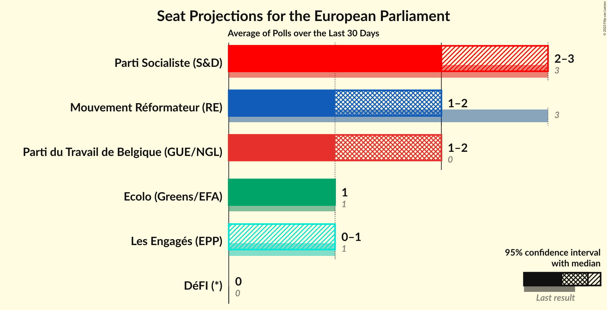

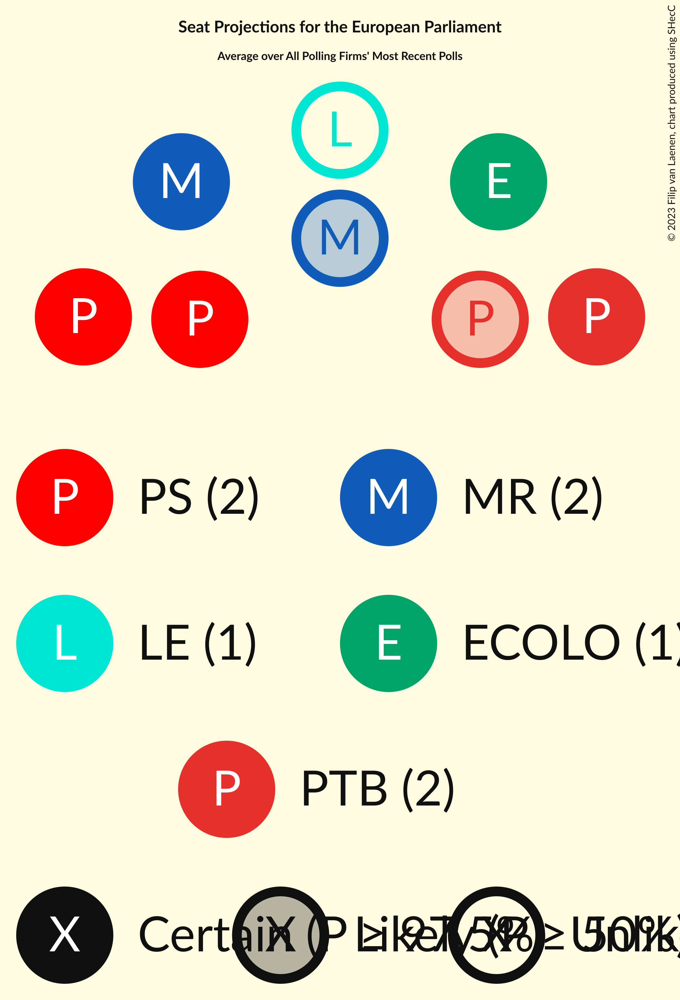

### Confidence Intervals

| Party | Last Result | Median | 80% Confidence Interval | 90% Confidence Interval | 95% Confidence Interval | 99% Confidence Interval |
|:-----:|:-----------:|:------:|:-----------------------:|:-----------------------:|:-----------------------:|:-----------------------:|
| <a href="#parti-socialiste-(s&d)">Parti Socialiste (S&D)</a> | 3 | 2 | 2–3 |2–3 | 2–3 | 2–3 |
| <a href="#mouvement-réformateur-(re)">Mouvement Réformateur (RE)</a> | 3 | 2 | 2 |1–2 | 1–2 | 1–2 |
| <a href="#ecolo-(greens/efa)">Ecolo (Greens/EFA)</a> | 1 | 1 | 1 |1 | 1 | 1–2 |
| <a href="#les-engagés-(epp)">Les Engagés (EPP)</a> | 1 | 0 | 0–1 |0–1 | 0–1 | 0–1 |
| <a href="#parti-populaire-(ni)">Parti Populaire (NI)</a> | 0 | N/A | N/A |N/A | N/A | N/A |
| <a href="#parti-du-travail-de-belgique-(gue/ngl)">Parti du Travail de Belgique (GUE/NGL)</a> | 0 | 2 | 2 |2 | 1–2 | 1–2 |
| <a href="#défi-(*)">DéFI (*)</a> | 0 | 0 | 0 |0 | 0 | 0–1 |
| <a href="#debout-les-belges-(*)">Debout les Belges (*)</a> | 0 | N/A | N/A |N/A | N/A | N/A |
| <a href="#la-droite-(*)">La Droite (*)</a> | 0 | N/A | N/A |N/A | N/A | N/A |
| <a href="#r.w.f.-(*)">R.W.F. (*)</a> | 0 | N/A | N/A |N/A | N/A | N/A |
| <a href="#wallonie-d’abord-(*)">Wallonie d’Abord (*)</a> | 0 | N/A | N/A |N/A | N/A | N/A |
| <a href="#pirate-(greens/efa)">PIRATE (Greens/EFA)</a> | 0 | N/A | N/A |N/A | N/A | N/A |
| <a href="#fw-(*)">FW (*)</a> | 0 | N/A | N/A |N/A | N/A | N/A |
| <a href="#islam-(*)">ISLAM (*)</a> | 0 | N/A | N/A |N/A | N/A | N/A |

### Parti Socialiste (S&D)

*For a full overview of the results for this party, see the [Parti Socialiste (S&D)](party-partisocialistesd.html) page.*

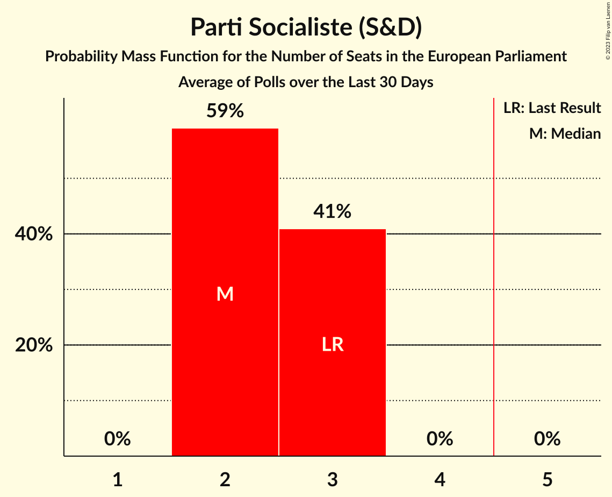

| Number of Seats | Probability | Accumulated | Special Marks |
|:---------------:|:-----------:|:-----------:|:-------------:|
| 2 | 59% | 100% | Median |
| 3 | 41% | 41% | Last Result |
| 4 | 0% | 0% |  |

### Mouvement Réformateur (RE)

*For a full overview of the results for this party, see the [Mouvement Réformateur (RE)](party-mouvementréformateurre.html) page.*

| Number of Seats | Probability | Accumulated | Special Marks |
|:---------------:|:-----------:|:-----------:|:-------------:|
| 1 | 7% | 100% |  |
| 2 | 93% | 93% | Median |
| 3 | 0.3% | 0.3% | Last Result |
| 4 | 0% | 0% |  |

### Ecolo (Greens/EFA)

*For a full overview of the results for this party, see the [Ecolo (Greens/EFA)](party-ecologreensefa.html) page.*

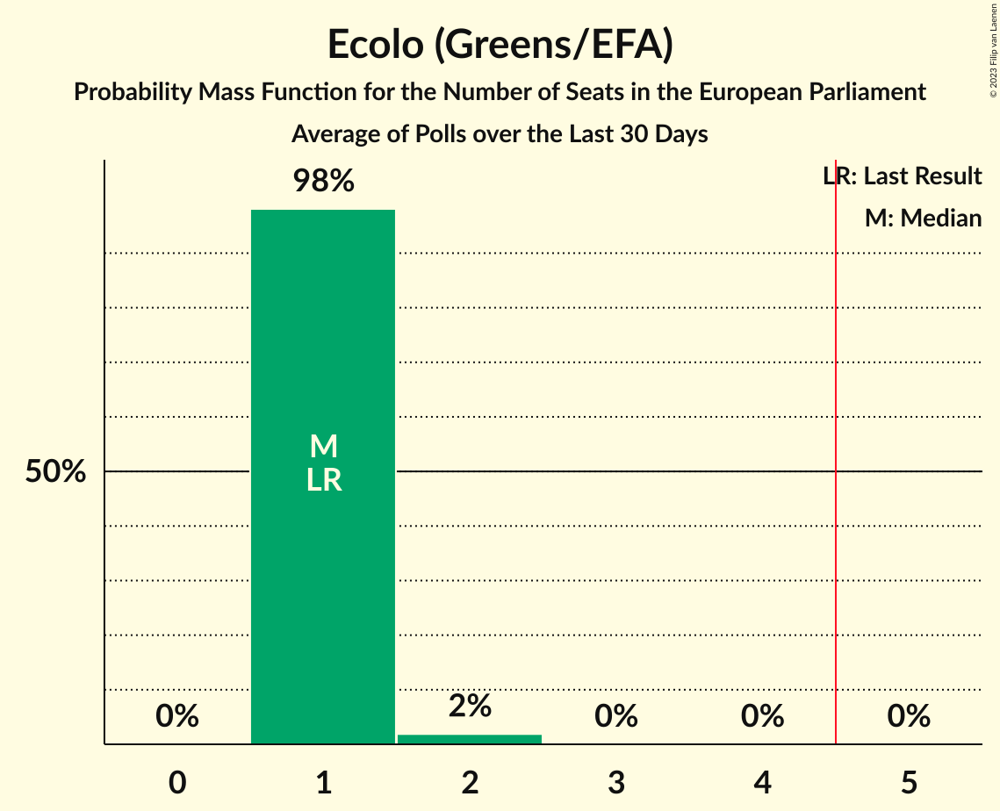

| Number of Seats | Probability | Accumulated | Special Marks |
|:---------------:|:-----------:|:-----------:|:-------------:|
| 1 | 98% | 100% | Last Result, Median |
| 2 | 2% | 2% |  |
| 3 | 0% | 0% |  |

### Les Engagés (EPP)

*For a full overview of the results for this party, see the [Les Engagés (EPP)](party-lesengagésepp.html) page.*

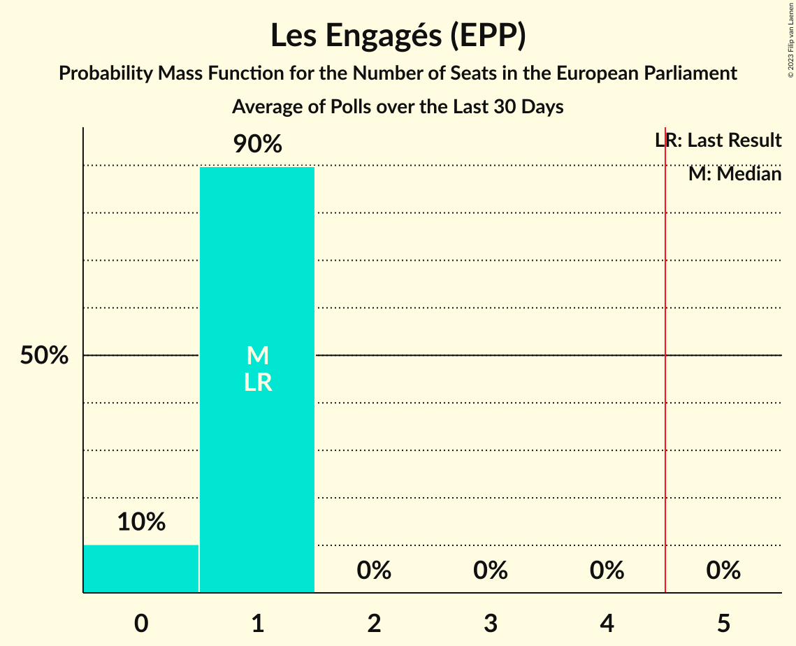

| Number of Seats | Probability | Accumulated | Special Marks |
|:---------------:|:-----------:|:-----------:|:-------------:|
| 0 | 53% | 100% | Median |
| 1 | 47% | 47% | Last Result |
| 2 | 0% | 0% |  |

### Parti Populaire (NI)

*For a full overview of the results for this party, see the [Parti Populaire (NI)](party-partipopulaireni.html) page.*

### Parti du Travail de Belgique (GUE/NGL)

*For a full overview of the results for this party, see the [Parti du Travail de Belgique (GUE/NGL)](party-partidutravaildebelgiqueguengl.html) page.*

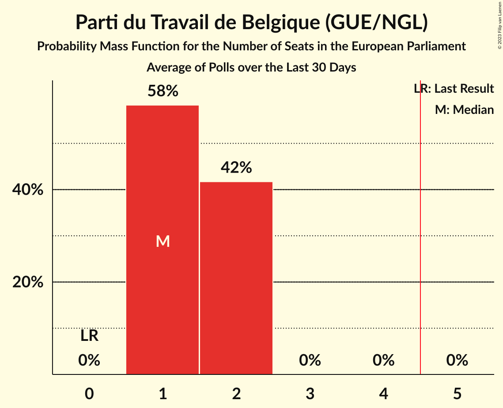

| Number of Seats | Probability | Accumulated | Special Marks |
|:---------------:|:-----------:|:-----------:|:-------------:|
| 0 | 0% | 100% | Last Result |
| 1 | 5% | 100% |  |
| 2 | 95% | 95% | Median |
| 3 | 0.5% | 0.5% |  |
| 4 | 0% | 0% |  |

### DéFI (*)

*For a full overview of the results for this party, see the [DéFI (*)](party-défi.html) page.*

| Number of Seats | Probability | Accumulated | Special Marks |
|:---------------:|:-----------:|:-----------:|:-------------:|
| 0 | 98% | 100% | Last Result, Median |
| 1 | 2% | 2% |  |
| 2 | 0% | 0% |  |

### Debout les Belges (*)

*For a full overview of the results for this party, see the [Debout les Belges (*)](party-deboutlesbelges.html) page.*

### La Droite (*)

*For a full overview of the results for this party, see the [La Droite (*)](party-ladroite.html) page.*

### R.W.F. (*)

*For a full overview of the results for this party, see the [R.W.F. (*)](party-rwf.html) page.*

### Wallonie d’Abord (*)

*For a full overview of the results for this party, see the [Wallonie d’Abord (*)](party-wallonied’abord.html) page.*

### PIRATE (Greens/EFA)

*For a full overview of the results for this party, see the [PIRATE (Greens/EFA)](party-pirategreensefa.html) page.*

### FW (*)

*For a full overview of the results for this party, see the [FW (*)](party-fw.html) page.*

### ISLAM (*)

*For a full overview of the results for this party, see the [ISLAM (*)](party-islam.html) page.*

## Coalitions

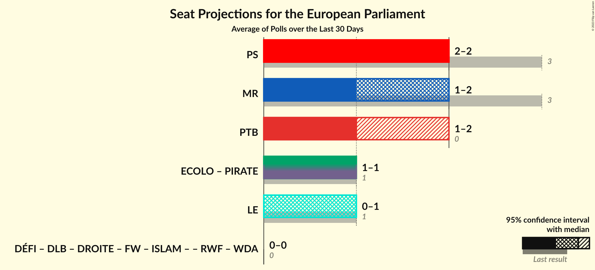

### Confidence Intervals

| Coalition | Last Result | Median | Majority? | 80% Confidence Interval | 90% Confidence Interval | 95% Confidence Interval | 99% Confidence Interval |
|:---------:|:-----------:|:------:|:---------:|:-----------------------:|:-----------------------:|:-----------------------:|:-----------------------:|
| Parti Socialiste (S&D) | 3 | 2 | 0% | 2–3 | 2–3 | 2–3 | 2–3 |
| Mouvement Réformateur (RE) | 3 | 2 | 0% | 2 | 1–2 | 1–2 | 1–2 |
| Parti du Travail de Belgique (GUE/NGL) | 0 | 2 | 0% | 2 | 2 | 1–2 | 1–2 |
| Ecolo (Greens/EFA) – PIRATE (Greens/EFA) | 1 | 1 | 0% | 1 | 1 | 1 | 1–2 |
| Les Engagés (EPP) | 1 | 0 | 0% | 0–1 | 0–1 | 0–1 | 0–1 |

### Parti Socialiste (S&D)

| Number of Seats | Probability | Accumulated | Special Marks |
|:---------------:|:-----------:|:-----------:|:-------------:|
| 2 | 59% | 100% | Median |
| 3 | 41% | 41% | Last Result |
| 4 | 0% | 0% |  |

### Mouvement Réformateur (RE)

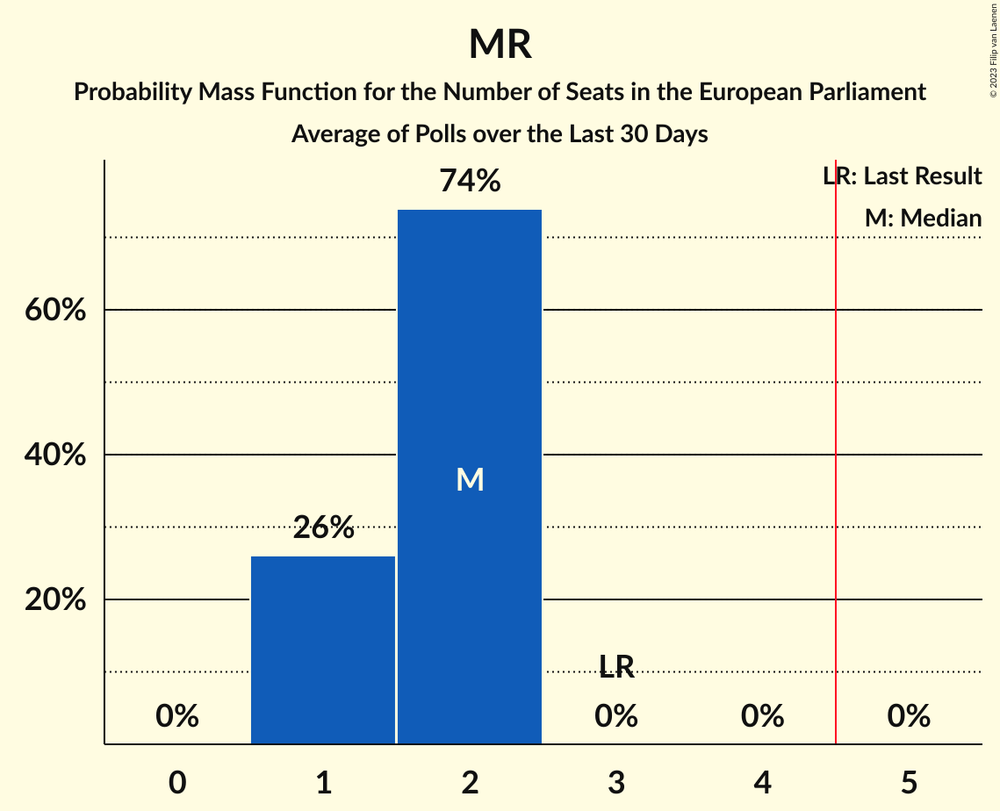

| Number of Seats | Probability | Accumulated | Special Marks |
|:---------------:|:-----------:|:-----------:|:-------------:|
| 1 | 7% | 100% |  |
| 2 | 93% | 93% | Median |
| 3 | 0.3% | 0.3% | Last Result |
| 4 | 0% | 0% |  |

### Parti du Travail de Belgique (GUE/NGL)

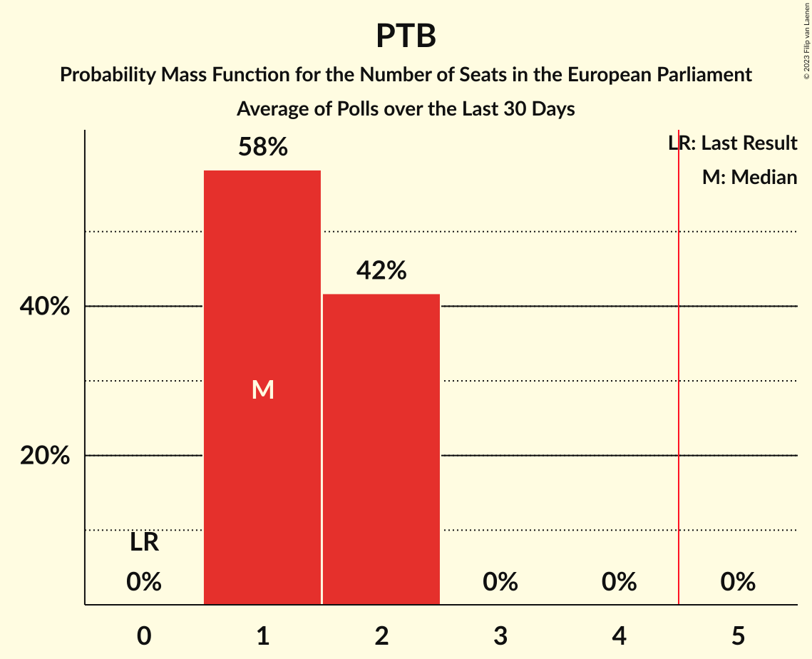

| Number of Seats | Probability | Accumulated | Special Marks |
|:---------------:|:-----------:|:-----------:|:-------------:|
| 0 | 0% | 100% | Last Result |
| 1 | 5% | 100% |  |
| 2 | 95% | 95% | Median |
| 3 | 0.5% | 0.5% |  |
| 4 | 0% | 0% |  |

### Ecolo (Greens/EFA) – PIRATE (Greens/EFA)

| Number of Seats | Probability | Accumulated | Special Marks |
|:---------------:|:-----------:|:-----------:|:-------------:|
| 1 | 98% | 100% | Last Result, Median |
| 2 | 2% | 2% |  |
| 3 | 0% | 0% |  |

### Les Engagés (EPP)

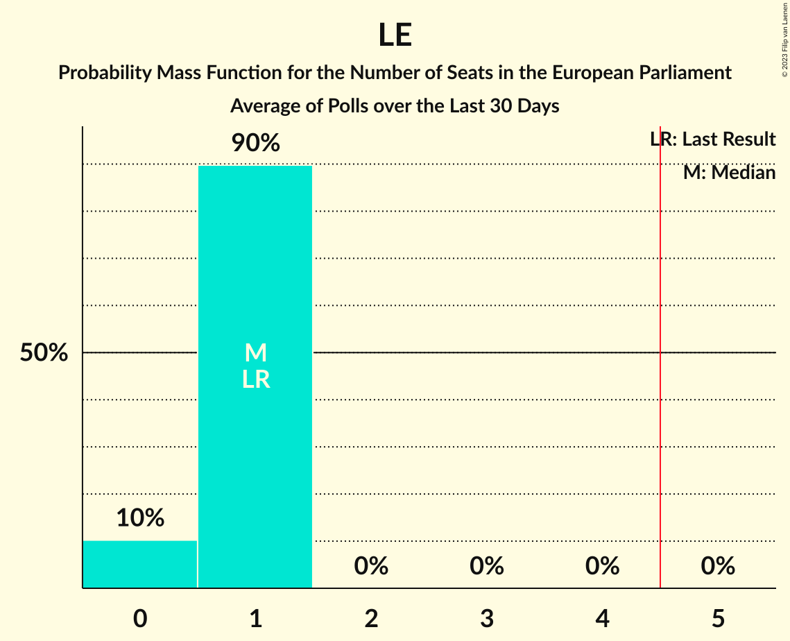

| Number of Seats | Probability | Accumulated | Special Marks |
|:---------------:|:-----------:|:-----------:|:-------------:|
| 0 | 53% | 100% | Median |
| 1 | 47% | 47% | Last Result |
| 2 | 0% | 0% |  |

## Technical Information

+ **Number of polls included in this average:** 1
+ **Lowest number of simulations done in a poll included in this average:** 1,048,576
+ **Total number of simulations done in the polls included in this average:** 1,048,576
+ **Error estimate:** 1.33%
