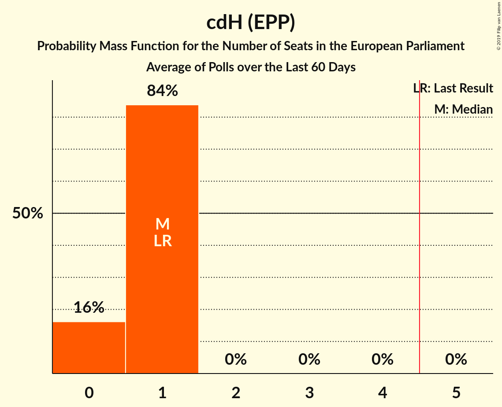

# cdH (EPP)

<a href="#voting-intentions">Voting Intentions</a> | <a href="#seats">Seats</a>

## Voting Intentions

Last result: **11.4%** (General Election of 25 May 2014)

### Confidence Intervals

| Period     | Polling firm/Commissioner(s) | Median | 80% Confidence Interval | 90% Confidence Interval | 95% Confidence Interval | 99% Confidence Interval |
|:----------:|:----------------:|:-----------:|:-----------------------:|:-----------------------:|:-----------------------:|:-----------------------:|
| N/A | [Poll Average](average.html) | 9.0% | 8.0–10.1% | 7.8–10.4% | 7.5–10.7% | 7.1–11.3% |
| [6–14 May 2019](2019-05-14-Ipsos.html) | Ipsos   Het Laatste Nieuws, Le Soir, RTL TVi and VTM | 9.3% | 8.3–10.4% | 8.0–10.8% | 7.8–11.1% | 7.3–11.6% |
| [25 March–14 April 2019](2019-04-14-TNS.html) | TNS   De Standaard, La Libre Belgique, RTBf and VRT | 9.0% | 8.0–10.1% | 7.8–10.5% | 7.5–10.7% | 7.1–11.3% |
| [5–11 February 2019](2019-02-11-Ipsos.html) | Ipsos   Het Laatste Nieuws, Le Soir, RTL TVi and VTM | 9.7% | 8.7–10.9% | 8.4–11.2% | 8.2–11.6% | 7.7–12.1% |
| [19 November–8 December 2018](2018-12-08-TNS.html) | TNS   De Standaard, La Libre Belgique, RTBf and VRT | 9.8% | 8.8–11.0% | 8.5–11.3% | 8.2–11.6% | 7.8–12.2% |
| [27 November–3 December 2018](2018-12-03-Ipsos.html) | Ipsos   Het Laatste Nieuws, Le Soir, RTL TVi and VTM | 10.2% | 9.1–11.4% | 8.8–11.7% | 8.6–12.0% | 8.1–12.6% |
| [20–27 September 2018](2018-09-27-Ipsos.html) | Ipsos   Het Laatste Nieuws, Le Soir, RTL TVi and VTM | 9.6% | 8.6–10.7% | 8.3–11.1% | 8.0–11.4% | 7.6–11.9% |
| [29 May–6 June 2018](2018-06-06-Ipsos.html) | Ipsos   Het Laatste Nieuws, Le Soir, RTL TVi and VTM | 8.9% | 8.0–10.1% | 7.7–10.4% | 7.4–10.7% | 7.0–11.2% |
| [26 February–17 March 2018](2018-03-17-TNS.html) | TNS   De Standaard–VRT–RTBf–La Libre Belgique | 10.9% | 9.9–12.2% | 9.6–12.5% | 9.3–12.8% | 8.8–13.4% |
| [27 February–6 March 2018](2018-03-06-Ipsos.html) | Ipsos   Het Laatste Nieuws–Le Soir–RTL Tvi–VTM | 7.1% | 6.2–8.2% | 6.0–8.5% | 5.8–8.7% | 5.4–9.3% |

### Probability Mass Function

The following table shows the probability mass function per percentage block of voting intentions for the [poll average](average.html) for cdH (EPP).

| Voting Intentions | Probability | Accumulated | Special Marks |
|:-----------------:|:-----------:|:-----------:|:-------------:|
| 5.5–6.5% | 0% | 100% |  |
| 6.5–7.5% | 3% | 100% |  |
| 7.5–8.5% | 24% | 97% |  |
| 8.5–9.5% | 46% | 73% | Median |
| 9.5–10.5% | 23% | 27% |  |
| 10.5–11.5% | 4% | 4% | Last Result |
| 11.5–12.5% | 0.2% | 0.2% |  |
| 12.5–13.5% | 0% | 0% |  |

## Seats

Last result: **1** seats (General Election of 25 May 2014)

### Confidence Intervals

| Period     | Polling firm/Commissioner(s) | Median | 80% Confidence Interval | 90% Confidence Interval | 95% Confidence Interval | 99% Confidence Interval |
|:----------:|:----------------:|:------:|:-----------------------:|:-----------------------:|:-----------------------:|:-----------------------:|
| N/A | [Poll Average](average.html) | 1 | 0–1 | 0–1 | 0–1 | 0–1 |
| [6–14 May 2019](2019-05-14-Ipsos.html) | Ipsos   Het Laatste Nieuws, Le Soir, RTL TVi and VTM | 1 | 1 | 1 | 1 | 0–1 |
| [25 March–14 April 2019](2019-04-14-TNS.html) | TNS   De Standaard, La Libre Belgique, RTBf and VRT | 1 | 0–1 | 0–1 | 0–1 | 0–1 |
| [5–11 February 2019](2019-02-11-Ipsos.html) | Ipsos   Het Laatste Nieuws, Le Soir, RTL TVi and VTM | 1 | 1 | 1 | 1 | 0–1 |
| [19 November–8 December 2018](2018-12-08-TNS.html) | TNS   De Standaard, La Libre Belgique, RTBf and VRT | 1 | 1 | 1 | 1 | 1 |
| [27 November–3 December 2018](2018-12-03-Ipsos.html) | Ipsos   Het Laatste Nieuws, Le Soir, RTL TVi and VTM | 1 | 1 | 1 | 1 | 1 |
| [20–27 September 2018](2018-09-27-Ipsos.html) | Ipsos   Het Laatste Nieuws, Le Soir, RTL TVi and VTM | 1 | 1 | 1 | 1 | 0–1 |
| [29 May–6 June 2018](2018-06-06-Ipsos.html) | Ipsos   Het Laatste Nieuws, Le Soir, RTL TVi and VTM | 1 | 1 | 0–1 | 0–1 | 0–1 |
| [26 February–17 March 2018](2018-03-17-TNS.html) | TNS   De Standaard–VRT–RTBf–La Libre Belgique | 1 | 1 | 1 | 1 | 1 |
| [27 February–6 March 2018](2018-03-06-Ipsos.html) | Ipsos   Het Laatste Nieuws–Le Soir–RTL Tvi–VTM | 0 | 0–1 | 0–1 | 0–1 | 0–1 |

### Probability Mass Function

The following table shows the probability mass function per seat for the [poll average](average.html) for cdH (EPP).

| Number of Seats | Probability | Accumulated | Special Marks |
|:---------------:|:-----------:|:-----------:|:-------------:|
| 0 | 16% | 100% |  |
| 1 | 84% | 84% | Last Result, Median |
| 2 | 0% | 0% |  |

