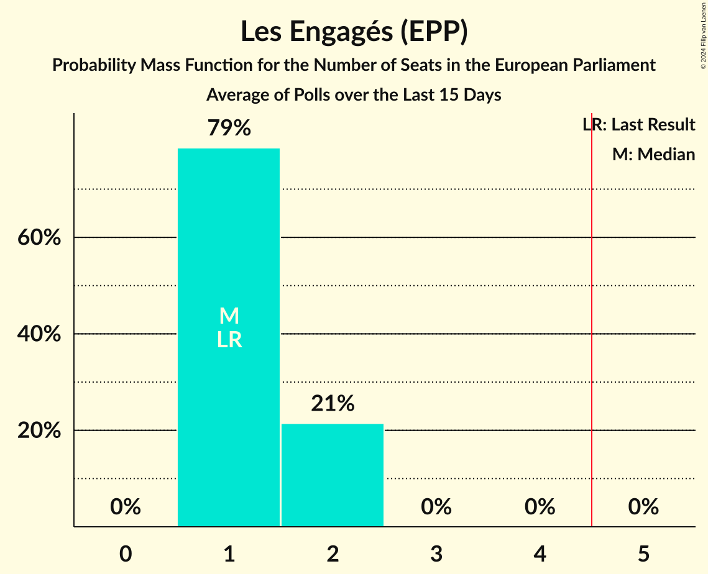

# Les Engagés (EPP)

<a href="#voting-intentions">Voting Intentions</a> | <a href="#seats">Seats</a>

## Voting Intentions

Last result: **11.4%** (General Election of 26 May 2019)

### Confidence Intervals

| Period     | Polling firm/Commissioner(s) | Median | 80% Confidence Interval | 90% Confidence Interval | 95% Confidence Interval | 99% Confidence Interval |
|:----------:|:----------------:|:-----------:|:-----------------------:|:-----------------------:|:-----------------------:|:-----------------------:|
| N/A | [Poll Average](average.html) | 12.8% | 11.6–14.0% | 11.2–14.4% | 11.0–14.7% | 10.4–15.4% |
| [8–18 April 2024](2024-04-18-Kantar.html) | Kantar   La Libre Belgique and RTBf | 12.7% | 11.6–14.1% | 11.2–14.4% | 11.0–14.8% | 10.4–15.4% |
| [23 February–5 March 2024](2024-03-05-Ipsos.html) | Ipsos   Euronews | 11.1% | 9.7–12.7% | 9.3–13.1% | 9.0–13.5% | 8.4–14.3% |
| [22 January–8 February 2024](2024-02-08-Kantar.html) | Kantar   Knack and Le Vif | 12.1% | 10.9–13.4% | 10.6–13.7% | 10.3–14.0% | 9.8–14.7% |
| [4–11 December 2023](2023-12-11-Ipsos.html) | Ipsos   Het Laatste Nieuws, Le Soir, RTL TVi and VTM | 12.8% | 11.6–14.1% | 11.3–14.4% | 11.0–14.8% | 10.5–15.4% |
| [10 September–9 October 2023](2023-10-09-Kantar.html) | Kantar   La Libre Belgique and RTBf | 10.3% | 8.7–12.2% | 8.3–12.7% | 7.9–13.2% | 7.2–14.1% |
| [18–25 September 2023](2023-09-25-Ipsos.html) | Ipsos   Het Laatste Nieuws, Le Soir, RTL TVi and VTM | 12.7% | 11.5–14.0% | 11.2–14.4% | 10.9–14.7% | 10.4–15.3% |
| [29 May–6 June 2023](2023-06-06-Ipsos.html) | Ipsos   Het Laatste Nieuws, Le Soir, RTL TVi and VTM | 9.3% | 8.3–10.5% | 8.0–10.8% | 7.8–11.1% | 7.3–11.7% |
| [20–27 March 2023](2023-03-27-Ipsos.html) | Ipsos   Het Laatste Nieuws, Le Soir, RTL TVi and VTM | 10.0% | 9.0–11.2% | 8.7–11.6% | 8.5–11.9% | 8.0–12.5% |
| [16–29 January 2023](2023-01-29-Kantar.html) | Kantar   La Libre Belgique and RTBf | 8.3% | 7.1–10.0% | 6.7–10.4% | 6.4–10.9% | 5.8–11.7% |
| [21–29 November 2022](2022-11-29-Ipsos.html) | Ipsos   Het Laatste Nieuws, Le Soir, RTL TVi and VTM | 8.5% | 7.6–9.6% | 7.3–10.0% | 7.1–10.2% | 6.7–10.8% |
| [7–13 September 2022](2022-09-13-Ipsos.html) | Ipsos   Het Laatste Nieuws, Le Soir, RTL TVi and VTM | 8.2% | 7.3–9.3% | 7.0–9.6% | 6.8–9.9% | 6.4–10.4% |
| [6–14 June 2022](2022-06-14-Ipsos.html) | Ipsos   Het Laatste Nieuws, Le Soir, RTL TVi and VTM | 8.0% | 7.1–9.1% | 6.8–9.4% | 6.6–9.7% | 6.2–10.3% |
| [15–22 March 2022](2022-03-22-Ipsos.html) | Ipsos   Het Laatste Nieuws, Le Soir, RTL TVi and VTM | 8.8% | 7.9–10.0% | 7.6–10.3% | 7.4–10.6% | 6.9–11.2% |
| [1–8 December 2021](2021-12-08-Ipsos.html) | Ipsos   Het Laatste Nieuws, Le Soir, RTL TVi and VTM | 7.7% | 6.8–8.8% | 6.5–9.1% | 6.3–9.4% | 5.9–9.9% |
| [7–14 September 2021](2021-09-14-Ipsos.html) | Ipsos   Het Laatste Nieuws, Le Soir, RTL TVi and VTM | 9.0% | 8.0–10.2% | 7.7–10.5% | 7.4–10.8% | 7.0–11.4% |
| [25 May–1 June 2021](2021-06-01-Ipsos.html) | Ipsos   Het Laatste Nieuws, Le Soir, RTL TVi and VTM | 10.0% | 8.9–11.2% | 8.6–11.5% | 8.4–11.8% | 7.9–12.4% |
| [4–9 March 2021](2021-03-09-Ipsos.html) | Ipsos   Het Laatste Nieuws, Le Soir, RTL TVi and VTM | 8.0% | 7.0–9.1% | 6.8–9.4% | 6.5–9.7% | 6.1–10.2% |
| [2–8 December 2020](2020-12-08-Ipsos.html) | Ipsos   Het Laatste Nieuws, Le Soir, RTL TVi and VTM | 9.5% | 8.5–10.7% | 8.2–11.1% | 8.0–11.3% | 7.5–11.9% |
| [2–8 October 2020](2020-10-08-Ipsos.html) | Ipsos   Het Laatste Nieuws, Le Soir, RTL TVi and VTM | 8.8% | 7.8–9.9% | 7.5–10.2% | 7.3–10.5% | 6.8–11.1% |
| [10–15 June 2020](2020-06-15-Ipsos.html) | Ipsos   Het Laatste Nieuws, Le Soir, RTL TVi and VTM | 7.7% | 6.8–8.8% | 6.5–9.1% | 6.3–9.3% | 5.9–9.9% |
| [4–9 March 2020](2020-03-09-Ipsos.html) | Ipsos   Het Laatste Nieuws, Le Soir, RTL TVi and VTM | 7.0% | 6.1–8.0% | 5.8–8.3% | 5.6–8.6% | 5.2–9.1% |
| [29 November–6 December 2019](2019-12-06-Ipsos.html) | Ipsos   Het Laatste Nieuws, Le Soir, RTL TVi and VTM | 8.4% | 7.4–9.5% | 7.1–9.8% | 6.9–10.1% | 6.5–10.7% |
| [2–10 September 2019](2019-09-10-Ipsos.html) | Ipsos   Het Laatste Nieuws, Le Soir, RTL TVi and VTM | 8.0% | 7.1–9.1% | 6.8–9.4% | 6.6–9.7% | 6.2–10.3% |

### Probability Mass Function

The following table shows the probability mass function per percentage block of voting intentions for the [poll average](average.html) for Les Engagés (EPP).

| Voting Intentions | Probability | Accumulated | Special Marks |
|:-----------------:|:-----------:|:-----------:|:-------------:|
| 8.5–9.5% | 0% | 100% |  |
| 9.5–10.5% | 0.7% | 100% |  |
| 10.5–11.5% | 9% | 99.3% | Last Result |
| 11.5–12.5% | 31% | 90% |  |
| 12.5–13.5% | 38% | 59% | Median |
| 13.5–14.5% | 18% | 21% |  |
| 14.5–15.5% | 3% | 4% |  |
| 15.5–16.5% | 0.3% | 0.3% |  |
| 16.5–17.5% | 0% | 0% |  |

## Seats

Last result: **1** seats (General Election of 26 May 2019)

### Confidence Intervals

| Period     | Polling firm/Commissioner(s) | Median | 80% Confidence Interval | 90% Confidence Interval | 95% Confidence Interval | 99% Confidence Interval |
|:----------:|:----------------:|:------:|:-----------------------:|:-----------------------:|:-----------------------:|:-----------------------:|
| N/A | [Poll Average](average.html) | 1 | 1 | 1 | 1 | 1 |
| [8–18 April 2024](2024-04-18-Kantar.html) | Kantar   La Libre Belgique and RTBf | 1 | 1 | 1 | 1 | 1 |
| [23 February–5 March 2024](2024-03-05-Ipsos.html) | Ipsos   Euronews | 1 | 1 | 1 | 0–1 | 0–1 |
| [22 January–8 February 2024](2024-02-08-Kantar.html) | Kantar   Knack and Le Vif | 1 | 1 | 1 | 1 | 1 |
| [4–11 December 2023](2023-12-11-Ipsos.html) | Ipsos   Het Laatste Nieuws, Le Soir, RTL TVi and VTM | 1 | 1 | 1 | 1 | 1 |
| [10 September–9 October 2023](2023-10-09-Kantar.html) | Kantar   La Libre Belgique and RTBf | 1 | 1 | 0–1 | 0–1 | 0–1 |
| [18–25 September 2023](2023-09-25-Ipsos.html) | Ipsos   Het Laatste Nieuws, Le Soir, RTL TVi and VTM | 1 | 1 | 1 | 1 | 1 |
| [29 May–6 June 2023](2023-06-06-Ipsos.html) | Ipsos   Het Laatste Nieuws, Le Soir, RTL TVi and VTM | 1 | 0–1 | 0–1 | 0–1 | 0–1 |
| [20–27 March 2023](2023-03-27-Ipsos.html) | Ipsos   Het Laatste Nieuws, Le Soir, RTL TVi and VTM | 1 | 0–1 | 0–1 | 0–1 | 0–1 |
| [16–29 January 2023](2023-01-29-Kantar.html) | Kantar   La Libre Belgique and RTBf | 0 | 0–1 | 0–1 | 0–1 | 0–1 |
| [21–29 November 2022](2022-11-29-Ipsos.html) | Ipsos   Het Laatste Nieuws, Le Soir, RTL TVi and VTM | 0 | 0–1 | 0–1 | 0–1 | 0–1 |
| [7–13 September 2022](2022-09-13-Ipsos.html) | Ipsos   Het Laatste Nieuws, Le Soir, RTL TVi and VTM | 0 | 0–1 | 0–1 | 0–1 | 0–1 |
| [6–14 June 2022](2022-06-14-Ipsos.html) | Ipsos   Het Laatste Nieuws, Le Soir, RTL TVi and VTM | 0 | 0–1 | 0–1 | 0–1 | 0–1 |
| [15–22 March 2022](2022-03-22-Ipsos.html) | Ipsos   Het Laatste Nieuws, Le Soir, RTL TVi and VTM | 1 | 0–1 | 0–1 | 0–1 | 0–1 |
| [1–8 December 2021](2021-12-08-Ipsos.html) | Ipsos   Het Laatste Nieuws, Le Soir, RTL TVi and VTM | 0 | 0–1 | 0–1 | 0–1 | 0–1 |
| [7–14 September 2021](2021-09-14-Ipsos.html) | Ipsos   Het Laatste Nieuws, Le Soir, RTL TVi and VTM | 1 | 0–1 | 0–1 | 0–1 | 0–1 |
| [25 May–1 June 2021](2021-06-01-Ipsos.html) | Ipsos   Het Laatste Nieuws, Le Soir, RTL TVi and VTM | 1 | 1 | 1 | 0–1 | 0–1 |
| [4–9 March 2021](2021-03-09-Ipsos.html) | Ipsos   Het Laatste Nieuws, Le Soir, RTL TVi and VTM | 0 | 0–1 | 0–1 | 0–1 | 0–1 |
| [2–8 December 2020](2020-12-08-Ipsos.html) | Ipsos   Het Laatste Nieuws, Le Soir, RTL TVi and VTM | 1 | 0–1 | 0–1 | 0–1 | 0–1 |
| [2–8 October 2020](2020-10-08-Ipsos.html) | Ipsos   Het Laatste Nieuws, Le Soir, RTL TVi and VTM | 0 | 0–1 | 0–1 | 0–1 | 0–1 |
| [10–15 June 2020](2020-06-15-Ipsos.html) | Ipsos   Het Laatste Nieuws, Le Soir, RTL TVi and VTM | 0 | 0–1 | 0–1 | 0–1 | 0–1 |
| [4–9 March 2020](2020-03-09-Ipsos.html) | Ipsos   Het Laatste Nieuws, Le Soir, RTL TVi and VTM | 0 | 0 | 0 | 0–1 | 0–1 |
| [29 November–6 December 2019](2019-12-06-Ipsos.html) | Ipsos   Het Laatste Nieuws, Le Soir, RTL TVi and VTM | 1 | 0–1 | 0–1 | 0–1 | 0–1 |
| [2–10 September 2019](2019-09-10-Ipsos.html) | Ipsos   Het Laatste Nieuws, Le Soir, RTL TVi and VTM | 0 | 0–1 | 0–1 | 0–1 | 0–1 |

### Probability Mass Function

The following table shows the probability mass function per seat for the [poll average](average.html) for Les Engagés (EPP).

| Number of Seats | Probability | Accumulated | Special Marks |
|:---------------:|:-----------:|:-----------:|:-------------:|
| 1 | 99.9% | 100% | Last Result, Median |
| 2 | 0.1% | 0.1% |  |
| 3 | 0% | 0% |  |

