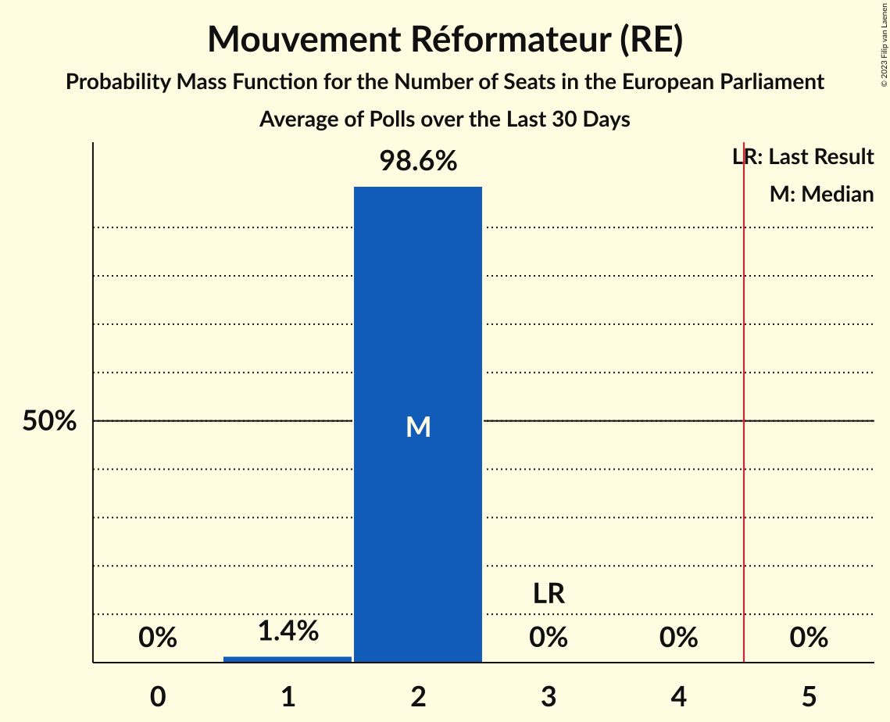

# Mouvement Réformateur (RE)

<a href="#voting-intentions">Voting Intentions</a> | <a href="#seats">Seats</a>

## Voting Intentions

Last result: **27.1%** (General Election of 26 May 2019)

### Confidence Intervals

| Period     | Polling firm/Commissioner(s) | Median | 80% Confidence Interval | 90% Confidence Interval | 95% Confidence Interval | 99% Confidence Interval |
|:----------:|:----------------:|:-----------:|:-----------------------:|:-----------------------:|:-----------------------:|:-----------------------:|
| N/A | [Poll Average](average.html) | 22.9% | 20.9–24.9% | 20.4–25.4% | 19.9–25.9% | 19.1–26.9% |
| [23 February–5 March 2024](2024-03-05-Ipsos.html) | Ipsos   Euronews | 22.8% | 20.9–24.9% | 20.4–25.4% | 19.9–25.9% | 19.1–26.9% |
| [22 January–8 February 2024](2024-02-08-Kantar.html) | Kantar   Knack and Le Vif | 19.9% | 18.5–21.5% | 18.1–21.9% | 17.8–22.3% | 17.1–23.1% |
| [4–11 December 2023](2023-12-11-Ipsos.html) | Ipsos   Het Laatste Nieuws, Le Soir, RTL TVi and VTM | 20.1% | 18.7–21.6% | 18.3–22.1% | 17.9–22.5% | 17.3–23.2% |
| [10 September–9 October 2023](2023-10-09-Kantar.html) | Kantar   La Libre Belgique and RTBf | 20.9% | 18.7–23.3% | 18.1–24.0% | 17.6–24.6% | 16.6–25.8% |
| [18–25 September 2023](2023-09-25-Ipsos.html) | Ipsos   Het Laatste Nieuws, Le Soir, RTL TVi and VTM | 20.4% | 18.9–21.9% | 18.5–22.4% | 18.2–22.8% | 17.5–23.5% |
| [29 May–6 June 2023](2023-06-06-Ipsos.html) | Ipsos   Het Laatste Nieuws, Le Soir, RTL TVi and VTM | 20.1% | 18.6–21.6% | 18.2–22.0% | 17.9–22.4% | 17.2–23.2% |
| [20–27 March 2023](2023-03-27-Ipsos.html) | Ipsos   Het Laatste Nieuws, Le Soir, RTL TVi and VTM | 18.8% | 17.4–20.3% | 17.0–20.7% | 16.6–21.0% | 16.0–21.8% |
| [16–29 January 2023](2023-01-29-Kantar.html) | Kantar   La Libre Belgique and RTBf | 19.5% | 17.6–21.7% | 17.0–22.4% | 16.6–22.9% | 15.7–24.0% |
| [21–29 November 2022](2022-11-29-Ipsos.html) | Ipsos   Het Laatste Nieuws, Le Soir, RTL TVi and VTM | 20.3% | 18.9–21.9% | 18.5–22.3% | 18.2–22.7% | 17.5–23.5% |
| [7–13 September 2022](2022-09-13-Ipsos.html) | Ipsos   Het Laatste Nieuws, Le Soir, RTL TVi and VTM | 21.9% | 20.5–23.5% | 20.0–23.9% | 19.7–24.3% | 19.0–25.1% |
| [6–14 June 2022](2022-06-14-Ipsos.html) | Ipsos   Het Laatste Nieuws, Le Soir, RTL TVi and VTM | 20.0% | 18.6–21.6% | 18.2–22.0% | 17.9–22.4% | 17.2–23.2% |
| [15–22 March 2022](2022-03-22-Ipsos.html) | Ipsos   Het Laatste Nieuws, Le Soir, RTL TVi and VTM | 20.3% | 18.9–21.9% | 18.5–22.3% | 18.2–22.7% | 17.5–23.5% |
| [1–8 December 2021](2021-12-08-Ipsos.html) | Ipsos   Het Laatste Nieuws, Le Soir, RTL TVi and VTM | 21.8% | 20.3–23.4% | 19.9–23.9% | 19.5–24.3% | 18.8–25.1% |
| [7–14 September 2021](2021-09-14-Ipsos.html) | Ipsos   Het Laatste Nieuws, Le Soir, RTL TVi and VTM | 20.3% | 18.8–21.9% | 18.4–22.3% | 18.0–22.7% | 17.3–23.5% |
| [25 May–1 June 2021](2021-06-01-Ipsos.html) | Ipsos   Het Laatste Nieuws, Le Soir, RTL TVi and VTM | 18.9% | 17.5–20.5% | 17.1–20.9% | 16.8–21.3% | 16.1–22.0% |
| [4–9 March 2021](2021-03-09-Ipsos.html) | Ipsos   Het Laatste Nieuws, Le Soir, RTL TVi and VTM | 19.9% | 18.4–21.4% | 18.0–21.9% | 17.6–22.3% | 17.0–23.1% |
| [2–8 December 2020](2020-12-08-Ipsos.html) | Ipsos   Het Laatste Nieuws, Le Soir, RTL TVi and VTM | 20.0% | 18.5–21.5% | 18.1–21.9% | 17.7–22.3% | 17.1–23.0% |
| [2–8 October 2020](2020-10-08-Ipsos.html) | Ipsos   Het Laatste Nieuws, Le Soir, RTL TVi and VTM | 18.7% | 17.3–20.2% | 16.9–20.6% | 16.6–21.0% | 15.9–21.7% |
| [10–15 June 2020](2020-06-15-Ipsos.html) | Ipsos   Het Laatste Nieuws, Le Soir, RTL TVi and VTM | 20.4% | 18.9–21.9% | 18.5–22.4% | 18.2–22.8% | 17.5–23.5% |
| [4–9 March 2020](2020-03-09-Ipsos.html) | Ipsos   Het Laatste Nieuws, Le Soir, RTL TVi and VTM | 19.6% | 18.2–21.2% | 17.8–21.6% | 17.4–22.0% | 16.7–22.7% |
| [29 November–6 December 2019](2019-12-06-Ipsos.html) | Ipsos   Het Laatste Nieuws, Le Soir, RTL TVi and VTM | 20.1% | 18.7–21.7% | 18.3–22.1% | 17.9–22.5% | 17.3–23.3% |
| [2–10 September 2019](2019-09-10-Ipsos.html) | Ipsos   Het Laatste Nieuws, Le Soir, RTL TVi and VTM | 21.8% | 20.3–23.4% | 19.9–23.9% | 19.6–24.3% | 18.9–25.1% |

### Probability Mass Function

The following table shows the probability mass function per percentage block of voting intentions for the [poll average](average.html) for Mouvement Réformateur (RE).

| Voting Intentions | Probability | Accumulated | Special Marks |
|:-----------------:|:-----------:|:-----------:|:-------------:|
| 16.5–17.5% | 0% | 100% |  |
| 17.5–18.5% | 0.1% | 100% |  |
| 18.5–19.5% | 1.1% | 99.8% |  |
| 19.5–20.5% | 5% | 98.7% |  |
| 20.5–21.5% | 13% | 94% |  |
| 21.5–22.5% | 23% | 80% |  |
| 22.5–23.5% | 25% | 58% | Median |
| 23.5–24.5% | 19% | 32% |  |
| 24.5–25.5% | 9% | 14% |  |
| 25.5–26.5% | 3% | 4% |  |
| 26.5–27.5% | 0.8% | 1.0% | Last Result |
| 27.5–28.5% | 0.1% | 0.2% |  |
| 28.5–29.5% | 0% | 0% |  |

## Seats

Last result: **3** seats (General Election of 26 May 2019)

### Confidence Intervals

| Period     | Polling firm/Commissioner(s) | Median | 80% Confidence Interval | 90% Confidence Interval | 95% Confidence Interval | 99% Confidence Interval |
|:----------:|:----------------:|:------:|:-----------------------:|:-----------------------:|:-----------------------:|:-----------------------:|
| N/A | [Poll Average](average.html) | 2 | 2 | 2 | 2 | 2–3 |
| [23 February–5 March 2024](2024-03-05-Ipsos.html) | Ipsos   Euronews | 2 | 2 | 2 | 2 | 2–3 |
| [22 January–8 February 2024](2024-02-08-Kantar.html) | Kantar   Knack and Le Vif | 2 | 2 | 2 | 2 | 2 |
| [4–11 December 2023](2023-12-11-Ipsos.html) | Ipsos   Het Laatste Nieuws, Le Soir, RTL TVi and VTM | 2 | 2 | 2 | 2 | 2 |
| [10 September–9 October 2023](2023-10-09-Kantar.html) | Kantar   La Libre Belgique and RTBf | 2 | 2 | 1–2 | 1–2 | 1–2 |
| [18–25 September 2023](2023-09-25-Ipsos.html) | Ipsos   Het Laatste Nieuws, Le Soir, RTL TVi and VTM | 2 | 2 | 2 | 2 | 2 |
| [29 May–6 June 2023](2023-06-06-Ipsos.html) | Ipsos   Het Laatste Nieuws, Le Soir, RTL TVi and VTM | 2 | 2 | 2 | 1–2 | 1–2 |
| [20–27 March 2023](2023-03-27-Ipsos.html) | Ipsos   Het Laatste Nieuws, Le Soir, RTL TVi and VTM | 2 | 1–2 | 1–2 | 1–2 | 1–2 |
| [16–29 January 2023](2023-01-29-Kantar.html) | Kantar   La Libre Belgique and RTBf | 2 | 2 | 1–2 | 1–2 | 1–2 |
| [21–29 November 2022](2022-11-29-Ipsos.html) | Ipsos   Het Laatste Nieuws, Le Soir, RTL TVi and VTM | 2 | 2 | 2 | 2 | 1–2 |
| [7–13 September 2022](2022-09-13-Ipsos.html) | Ipsos   Het Laatste Nieuws, Le Soir, RTL TVi and VTM | 2 | 2 | 2 | 2 | 2–3 |
| [6–14 June 2022](2022-06-14-Ipsos.html) | Ipsos   Het Laatste Nieuws, Le Soir, RTL TVi and VTM | 2 | 2 | 2 | 2 | 1–2 |
| [15–22 March 2022](2022-03-22-Ipsos.html) | Ipsos   Het Laatste Nieuws, Le Soir, RTL TVi and VTM | 2 | 2 | 2 | 2 | 1–2 |
| [1–8 December 2021](2021-12-08-Ipsos.html) | Ipsos   Het Laatste Nieuws, Le Soir, RTL TVi and VTM | 2 | 2 | 2 | 2–3 | 2–3 |
| [7–14 September 2021](2021-09-14-Ipsos.html) | Ipsos   Het Laatste Nieuws, Le Soir, RTL TVi and VTM | 2 | 2 | 2 | 2 | 1–2 |
| [25 May–1 June 2021](2021-06-01-Ipsos.html) | Ipsos   Het Laatste Nieuws, Le Soir, RTL TVi and VTM | 2 | 2 | 1–2 | 1–2 | 1–2 |
| [4–9 March 2021](2021-03-09-Ipsos.html) | Ipsos   Het Laatste Nieuws, Le Soir, RTL TVi and VTM | 2 | 2 | 2 | 2 | 1–2 |
| [2–8 December 2020](2020-12-08-Ipsos.html) | Ipsos   Het Laatste Nieuws, Le Soir, RTL TVi and VTM | 2 | 2 | 2 | 1–2 | 1–2 |
| [2–8 October 2020](2020-10-08-Ipsos.html) | Ipsos   Het Laatste Nieuws, Le Soir, RTL TVi and VTM | 2 | 1–2 | 1–2 | 1–2 | 1–2 |
| [10–15 June 2020](2020-06-15-Ipsos.html) | Ipsos   Het Laatste Nieuws, Le Soir, RTL TVi and VTM | 2 | 2 | 2 | 2 | 2 |
| [4–9 March 2020](2020-03-09-Ipsos.html) | Ipsos   Het Laatste Nieuws, Le Soir, RTL TVi and VTM | 2 | 2 | 2 | 2 | 1–2 |
| [29 November–6 December 2019](2019-12-06-Ipsos.html) | Ipsos   Het Laatste Nieuws, Le Soir, RTL TVi and VTM | 2 | 2 | 2 | 2 | 2 |
| [2–10 September 2019](2019-09-10-Ipsos.html) | Ipsos   Het Laatste Nieuws, Le Soir, RTL TVi and VTM | 2 | 2 | 2 | 2 | 2–3 |

### Probability Mass Function

The following table shows the probability mass function per seat for the [poll average](average.html) for Mouvement Réformateur (RE).

| Number of Seats | Probability | Accumulated | Special Marks |
|:---------------:|:-----------:|:-----------:|:-------------:|
| 1 | 0.4% | 100% |  |
| 2 | 98.9% | 99.6% | Median |
| 3 | 0.7% | 0.7% | Last Result |
| 4 | 0% | 0% |  |

